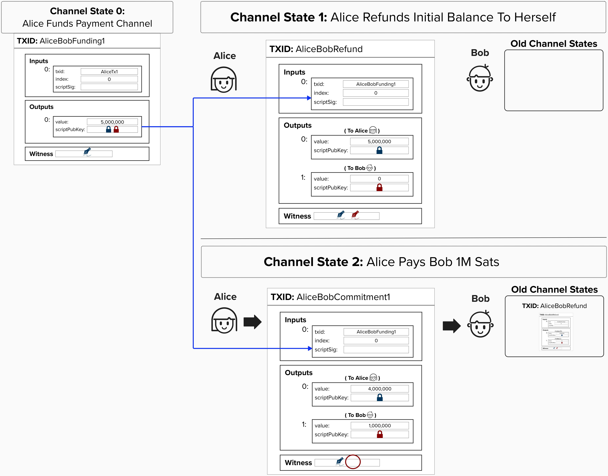
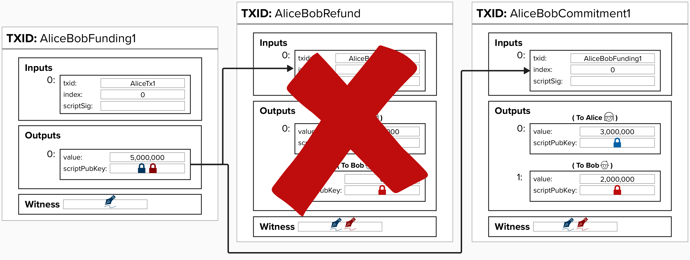

# Making a Payment

Once the funding transaction is mined and has recieved 6 confirmations, Alice and Bob can "update" their channel by committing to a new transaction that spends from the funding output. This new transaction is called a **commitment transaction** because it "committs" to a new channel balance. The new channel balance is reflected as **two** separate outputs - one representing the current balance for each recipient. They can do this however many times they would like. Each new transaction represents a new balance between Alice and Bob. When they decide to close the channel, they simply publish the most recent transaction to the Bitcoin network, distributing the funds to addresses that each party unilaterally controls.

For example, on the left side of the diagram below, you will see the funding transaction that we created in an earlier exercise. To make a payment that sends 2 bitcoin to Bob, all we have to do is create a new transaction that spends from the funding output and locks Alice's and Bob's respective amounts to their public keys.

  

## Security Flaw!

While the current construction works for updating channel balances, there is a considerably large security flaw here. If Alice wanted to act maliciously, she could steal all of Bob's funds. Can you identify what the security flaw is? 

  
Answer

   

With the current construction, each new commitment transaction spends the from the funding transaction. Since each new commitment transaction is a valid transaction that can be broadcasted to the Bitcoin network at any time, there is nothing stopping Alice from broadcasting the refund transaction and claiming the full refund channel's balance!

To mitigate against this, we need to figure out a way ensure that old commitment transactions are **revoked**. For instance, in this case, we'd like to revoke the refund transaction such that it's no longer spendable.

  

Unfortunately, there is no way to cancel or invalidate a Bitcoin transaction after it's created, so we need to come up with a clever way to *disincentivize* Alice and Bob from broadcastnig old transactions.

See if you can think of something! When you're ready, jump to the next section to learn how it's done in the Lightning Network.

