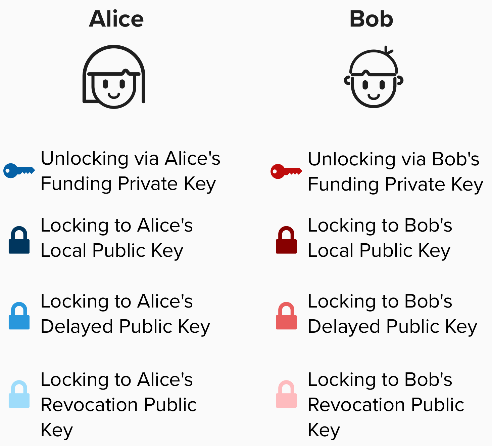
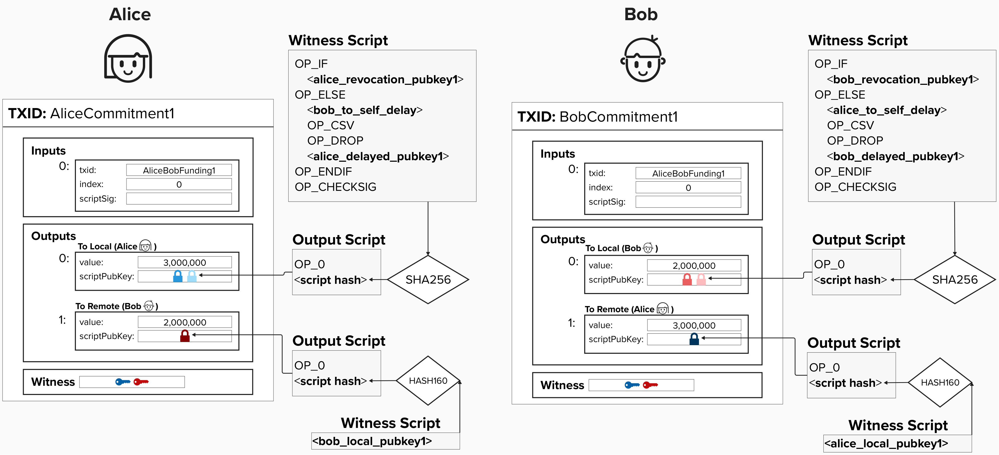

# Asymmetric Commitment Transactions 
Up until now, there is a pretty important detail that has been abstracted away from our commitment transactions.

In the actual Lightning Network, each party has their own version of ***each*** commitment transaction. They are mirror images of each other, but they do not contain the exact same information. For example, below you will see both Alice and Bob's respective version of the commitment transaction that reflects the first update they made to their channel: Alice sending Bob 2 bitcoin.

Before reviewing the commitment transactions, note that we've added another public key for both Alice and Bob. This public key represents each party's **revocation public key**. When Alice and Bob decide to move to a new channel state (create a new commitment transaction), they give eachother the information needed to calculate each other's **revocation private key**. This is how we effectively revoke old transactions. Since, if you publish an old transaction, you've already given your counterparty a way to spend all of your funds (which would be very bad for you!).

<p align="center" style="width: 50%; max-width: 300px;">
  
</p>

<p align="center" style="width: 50%; max-width: 300px;">
  
</p>

## Creating Revocation Keys

<p align="center" style="width: 50%; max-width: 300px;">
  
</p>

## ⚡️ Write Function `generate_revocation_pubkey` To Generate A Revocation Public Key For Our Output Script
```rust
fn generate_revocation_pubkey(countersignatory_basepoint: &PublicKey, per_commitment_point: &PublicKey) -> PublicKey {
}
```

This will get a little mathy, but don't worry! We'll step through it together. Below is the general equation for calculating a revocation public key.

First, let's define the following terms:

<p align="center" style="width: 50%; max-width: 300px;">
  
</p>

In the above terms:
- `R` is the remote party's revocation basepoint. If Alice is calcuating the revocation public key, then this will be Bob's revocation basepoint, which Bob gives to Alice when they set up the channel.
- `S` is Alice's per commitment point. Remember, this is a public key that is unique to every commitment transaction.
- `h1` is the SHA256 hash of both public keys. The `||` symbol means "concatenate". Therefore, to calculate `h1`, we serialize both keys, concatenate them together, and then take the hash of the result.
- `h2` is the SHA256 hash of both public keys, but in the opposite order as `h1`.


The function to calculate the revocation public key is:

<p align="center" style="width: 50%; max-width: 300px;">
  
</p>

Try to complete the function `generate_revocation_pubkey` to calculate the revocation public key when given a counterparty's revocation basepoint and your own per commitment point. This function should return the revocation public key we need to include in our commitment transaction.

To help you with completing this excercise, the following functions are available to you:

```rust
pub fn pubkey_multiplication_tweak(pubkey1: PublicKey, sha_bytes: [u8; 32]) -> PublicKey {
  // convert sha256 output to scalar
  // "tweak" public key by multiplying it by the scalar
}
```

```rust
pub fn sha256_hash(key1: &PublicKey, key2: &PublicKey) -> [u8; 32] {
  // calculate the sha256 hash of two public keys
  // pubkey1 is added to stack first
  // pubkey2 is added to stack second
  // the shar256 of the combined pubkeys is returned 
}
```
Finally, note that you can add two public keys together by using the `.combine()` syntax. For example:
```rust
key1.combine(key2)
```

Okay, you should have everything you need to implement `generate_revocation_pubkey` using the above functions and methods! If you would like a hint, click below:
<details>
  <summary>Hint</summary>
  <br/>

Try implementing the following pseudo-code:
- Calculate `h1` by obtaining the SHA256 of `R` and `P` concatenated.
- Calculate `h2` by obtaining the SHA256 of `P` and `R` concatenated.
- Multiply `R` by `h1`. Remember, `R` is a public key and `h1` is a SHA256 hash, which will be interpreted as a scalar to "tweak" the public key.
- Multiply `P` by `h2`. Remember, `P` is a public key and `h2` is a SHA256 hash, which will be interpreted as a scalar to "tweak" the public key.
- Add the result of the two multiplications above. This is effectively adding two public keys together.

</details>

#
#
#### A keen eye may have already noticed that this penalty mechanism is missing something very important. Can you tell what it is?

Here is a hint: *Timing is everything!*

<details>
  <summary>Answer</summary>
  <br/>

So, a counterparty is able to claim all of the funds if the owner tries to cheat them and publish an old transaction. That's good! However, with the current construction, the counterparty would have to act immediately and, essentially, outbid the owner in the mempool. If the counterparty is unable to outbid them and get their transaction mined first, then the original owner would succeed in publishing an old transaction.

Even worse, the original owner could just go directly to a miner and hand them the transaction "under the table", meaning that it would never be broadcasted among the network, so the counterparty wouldn't know until it's too late.

Therefore, to stop this from happening, we must add a timelock to the transaction so that, if the original owner does succeed in getting an old transaction mined, the counterparty has a window of time to steal all of the funds!

We'll review how this works in the next section. Do you know which timelock feature we will use to accomplish this?

</details>