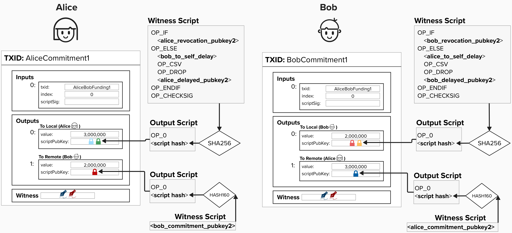
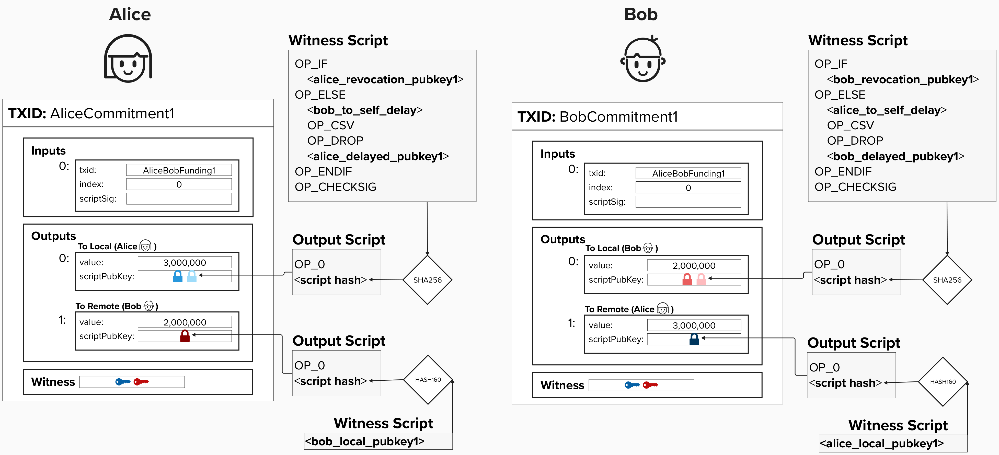

# Adding Time Constraints To Revocable Transactions

We're getting close to building a robust penalty mechanism that allows us to, in practice, revoke old commitment transactions. 

We saw in the last exercise that, while there is a revocation key that the counterparty can use, there are still situations where the owner of the funds can steal them before the counterparty has a chance to act. To resolve this, we can add a relative timelock to the output such that the owner can only use that output as an input to another transaction *after* a certain amount of blocks have been mined. To do this, we can leverage the **Check Sequence Verify** ```OP_CSV``` operation code (also known as **opcode**) within our output script.

By including the ```OP_CSV``` opcode in our script, we ensure that the output cannot be sent to the original owner's address until a pre-specified amount of blocks have passed *since the transaction was mined on chain*. This solves the problem we identified previously because, if a channel partner tried to publish an old state (whether that was publically, via the mempool, or privately, by handing the transacation directly to a miner), the counterparty just has to monitor the blockchain to see if an old transaction is published. If they do see the old transaction, they now have time (usually 144 blocks) to publish claim those funds via the revocation key spending path.

<p align="center" style="width: 50%; max-width: 300px;">
  
</p>

<p align="center" style="width: 50%; max-width: 300px;">
  
</p>

Below are some important things to note about these commitment transactions:

- **OP_CSV Timelocks**: Before setting up the payment channel, Alice and Bob will communicate their expectations for the channel. For example, Bob may only open channels in which his counterparty agrees to delay their ```to_local``` outputs by at least 144 blocks (about 24 hours).

- **Delayed Public Keys**: Both channels will have generate a specific public key for each commitment transaction. This public key will be referenced within their ```to_local``` output and be encumbered with a time delay. Remember, within the Bitcoin Lightning Network, we always time-delay ```to_local``` outputs to protect our channel partner from us cheating.

<p align="center" style="width: 50%; max-width: 300px;">
  
</p>

## ⚡️ Write Function `to_local` To Generate A ```to_local``` Output Script For Our Commitment Transaction

`to_local` will take a ``revocation_key``, ```to_local_delayed_pubkey```, and ```to_self_delay``` number of blocks as an input. It will return the output script we need to use.


```rust
fn to_local(revocation_key: &PublicKey, to_local_delayed_pubkey: &PublicKey, to_self_delay: &i64) -> Script {
}
```