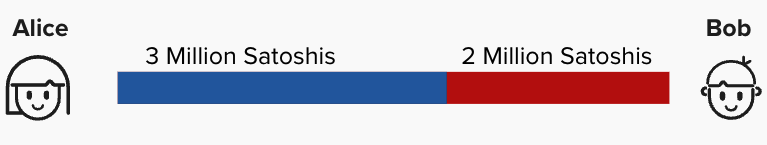
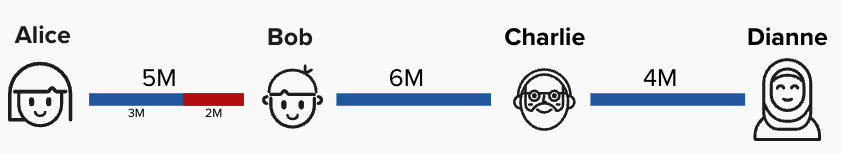

# The Lightning Network: A Collection of Payment Channels

We've now seen how Alice and Bob can use a combination of an off-chain protocol and bitcoin transactions to build a payment channel between themselves. In this payment channel, Alice and Bob can continuously transfer funds between themselves by updating their channel balances. This is accomplished in such a way that neither Alice nor Bob needs to trust each other. Instead, they trust that the protocol is set up in such a way that their counterparty won't cheat them, because, if they did, they would be able to claim all of their counterparty's bitcoin.

As we saw in the last exercise, Alice and Bob now have a new commitment transaction that pays Alice 3M bitcoin and Bob 2M bitcoin. This represents their respective channel balances.

<p align="center" style="width: 50%; max-width: 300px;">
  
</p>

The magic of Lightning is that Alice and Bob can create payment channels with other nodes, creating a network of payment channels. Each payment channel represents its own set of funding and commitment transactions between the two parties in the payment channel. For example, imagine that Bob is also connected to Charlie, and Charlie is connected to Dianne. In this case, we have the following payment channels:
1) Alice & Bob
2) Bob & Charlie
3) Charlie & Dianne

<p align="center" style="width: 50%; max-width: 300px;">
  
</p>

Let's imagine Alice wants to send a payment to Dianne. Using the Lightning Network, she can route a payment across these payment channels to Dianne. It's important to note that Alice is aware of this path because her node continuously updates its **network graph** by listening to **"gossip"** from other nodes. Gossip is simply a communication protocol that defines how nodes should inform eachother of updates to the network. We'll dig into this more later, but, for now, it's sufficient to note that Alice is aware of this payment path to Dianne, and she knows the total **capacity** that each channel has. A channel's capacity represents the total amount of bitcoin that are locked within that channel. However, what Alice does not know is *how those bitcoin are distributed*. For example, she does not know if Bob's channel with Charlie evenly distributed (3M on each side) or if all of the funds are on Bob's side. She only knows the distribution of her own channel with Bob.


# Routing Payments

Believe it or not, utilizing what we've learned about so far, we can set up a way to trustlessly route payments across this network. For example, suppose Alice wants to route a payment of 400,000 sats to Dianne. You can assume that channel balances are distributed such that this is possible. Take a minute to think through how we can set up a new commitment transaction that does this. How will we represent this new output? Will it be included in the ```to_local``` or ```to_remote``` outputs, or will it be its own output? When you're ready, click "Answer" below.

<details>
  <summary>Answer</summary>
  <br/>

add answer here

</details>