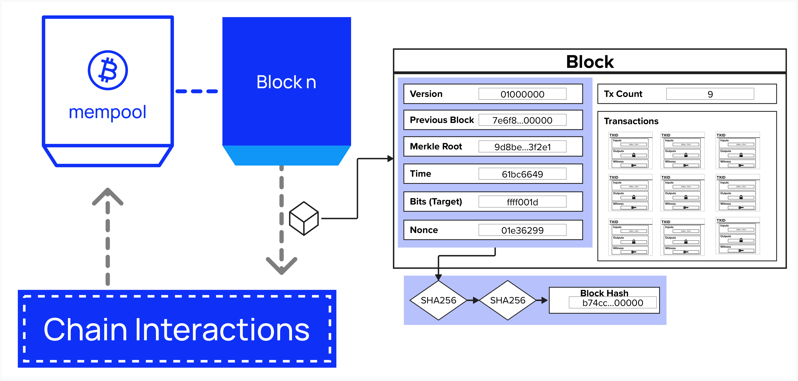
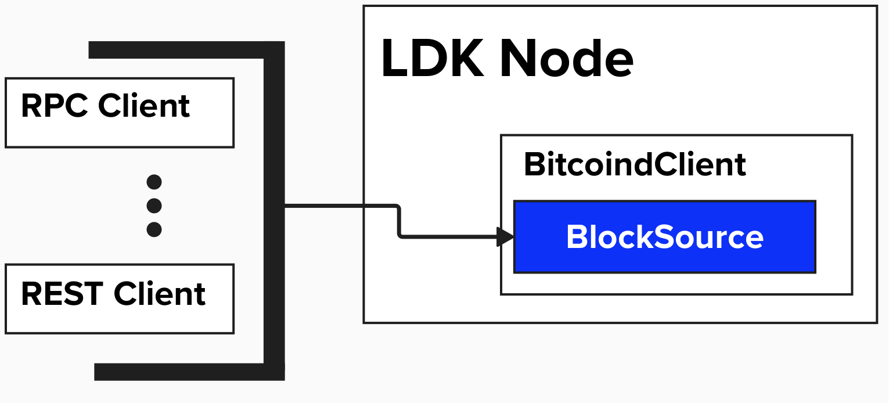

# Connecting To The Bitcoin Blockchain

Before we can get to any complex Lightning Network functionality, we need to begin by anchoring our node to the Bitcoin blockchain so that it can monitor and interact with the network.

<p align="center" style="width: 50%; max-width: 300px;">
  
</p>

#### Question: What specific tasks or functions will our Lightning node need to perform when interacting with the Bitcoin blockchain?

<details>
  <summary>
    Answer
</summary>

As we just learned, the backbone of Lightning is a fairness protocol. Two parties agree to exchange bitcoin transactions off-chain, but transactions can be published to the chain if a given party needs to enforce the fairness protocol.

There are many answers to this question. Below are a few:
- Broadcasting transactions
  - Channel funding
  - Channel closing
  - Commitment / HTLCs
  - Justice (punishment)
- Monitoring blocks and transactions
  - Identify when funding transaction is mined (with ***x*** confirmations)
  - Spot if channel party attempts to publish an old state
- Fee Estimation
  - Via Bitcoin RPC `getmempoolinfo`

</details>

## LDK Blockchain Interface

When it comes to communicating with the Bitcoin Blockchain, LDK will need to both send data (ex: transactions) and recieve data (ex: blocks). For this portion of the workshop, we'll focus on the receiving end - configuring LDK so that it is notified of new blocks and/or confirmed transactions. This information is neccessary so that we can successfuly maintain channel states and monitor for relevant on-chain activity.

Below is a diagram depicting a few imporant data types that our node will need to be able to retrieve from the Bitcoin blockchain.

1) Block Height
2) Block Data (Header + Transactions)
3) Block Hash

<p align="center" style="width: 50%; max-width: 300px;">
  
</p>

To aid in retrieving this information, LDK provides a `lightning-block-sync` utility that handles polling a block source for the best chain tip, detecting chain forks, and notifying other LDK components when blocks are connected or disconnected.

It should be noted that developers have the option to build a custom blockchain interface instead of using the `lightning-block-sync` utility. If they choose to do this, they will need to manually parse blockchain data and notify LDK components such as `ChannelManager` and `ChainMonitor` that new blocks have been connected or disconnected.

For this workshop, we will build a **Simple Payment Verification (SPV)** client that will periodically poll our Replit's Regtest network for the best chain tip. The below diagram shows a very high-level view of what this architecure will look like. Since LDK is a modular software development kit, it's up to us to implement the actual connection to the Bitcoin blockchain. We can do this by completing the `BlockSource` trait with our chosen method (RPC, REST, etc.).

### Implementing BlockSource

The `BlockSource` trait defines specific functionality that LDK requires, but it provides us with the flexibility to choose how we'd like to implement this functionality. For example, one function is `get_header`. LDK doesn't particularly care how we obtain this information - we just have to return it in the data type specified in the function statement. In this case, `get_header` requires a `BlockHeaderData` type to be returned.

```rust
pub trait BlockSource: Sync + Send {
    // Required methods - need to be implemented by the user
    fn get_header<'a>(
        &'a self,
        header_hash: &'a BlockHash,
        height_hint: Option<u32>,
    ) -> AsyncBlockSourceResult<'a, BlockHeaderData>;
    
    fn get_block<'a>(
        &'a self,
        header_hash: &'a BlockHash,
    ) -> AsyncBlockSourceResult<'a, BlockData>;
    
    fn get_best_block<'a>(
        &'a self,
    ) -> AsyncBlockSourceResult<'_, (BlockHash, Option<u32>)>;
}
```

LDK provides `BlockSource` implementations for `RestClient` and `RpcClient`, which provide functionality to interact with Bitcoin Core via REST and RPC interfaces. For our application, we'll implement the `RpcClient` client. Since we'll ultimately need to add additional functionalty (such as broadcasting transactions), we'll define a structure, called `BitcoindClient`, to store information related to our RPC connection and implement both the sending and recieving of data to the Bitcoin blockchain.

As a reminder, note that we could have choosen to implement `BlockSource` with `RestClient` or another custom configuration. LDK does not enforce a specific method.

<p align="center" style="width: 50%; max-width: 300px;">
  
</p>

### Defining BitcoindClient
Here's how we can create a custom Bitcoin Core client:
```rust
pub struct BitcoindClient {
    pub(crate) bitcoind_rpc_client: Arc<RpcClient>,
    network: Network,
    host: String,
    port: u16,
    rpc_user: String,
    rpc_password: String
}
```
We can now implement all the required methods form the `BlockSource` trait by delegating to the corresponding methods in our `bitcoind_rpc_client`.

## ⚡️ Implement `BlockSource` For Our `BitcoindClient`
Complete the implementation of `BlockSource` for `BitcoindClient`. You'll need to implement:

1. `get_header`: Fetches a block header by its hash
2. `get_block`: Fetches a complete block by its hash
3. `get_best_block`: Fetches information about the most recent block

### Available Methods

You have access to `self.bitcoind_rpc_client` which provides these RPC methods:
- `get_header(header_hash, height_hint)` - Returns block header data
- `get_block(header_hash)` - Returns full block data
- `get_best_block()` - Returns the latest block info

Below is some code to get you started. Note, for technical reasons outside the scope of this workshop, you'll want to wrap your ```self.bitcoind_rpc_client.``` statements in `Box::pin(async move {  })`.
```rust
impl BlockSource for BitcoindClient {
    fn get_header<'a>(
        &'a self, header_hash: &'a BlockHash, height_hint: Option<u32>,
    ) -> AsyncBlockSourceResult<'a, BlockHeaderData> {
        // 1. Use self.bitcoind_rpc_client.get_header
        // 2. Wrap the async call with Box::pin(async move { ... })
    }

    fn get_block<'a>(
        &'a self, header_hash: &'a BlockHash,
    ) -> AsyncBlockSourceResult<'a, BlockData> {
        // 1. Use self.bitcoind_rpc_client.get_block
        // 2. Wrap the async call with Box::pin(async move { ... })

    }

    fn get_best_block<'a>(&'a self) -> AsyncBlockSourceResult<(BlockHash, Option<u32>)> {
        // 1. Use self.bitcoind_rpc_client.get_best_block
        // 2. Wrap the async call with Box::pin(async move { ... })
    }
}
```