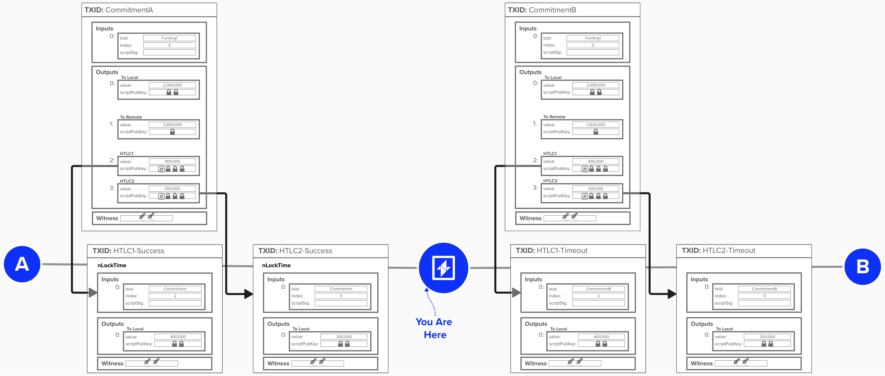
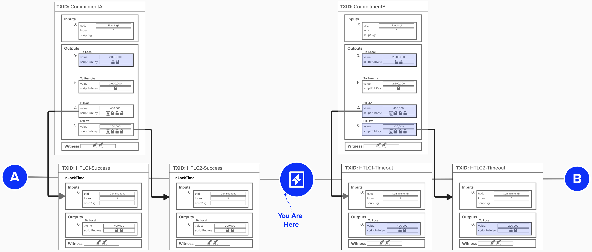
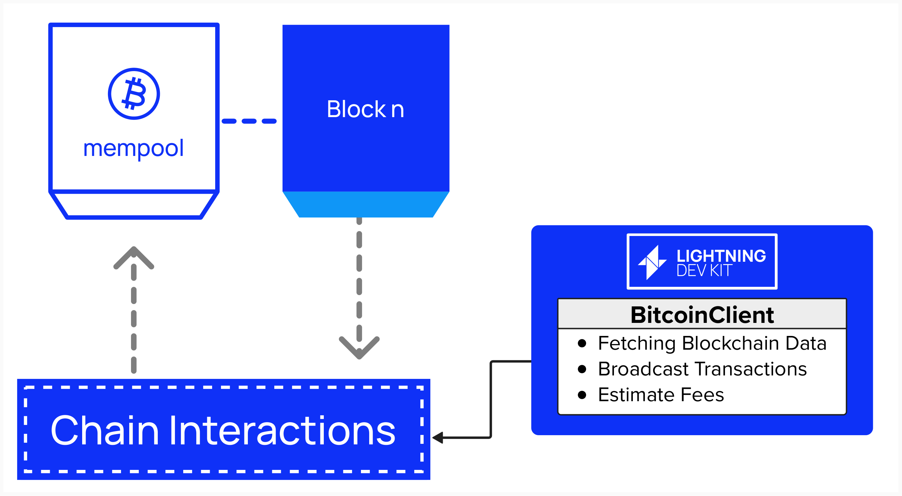
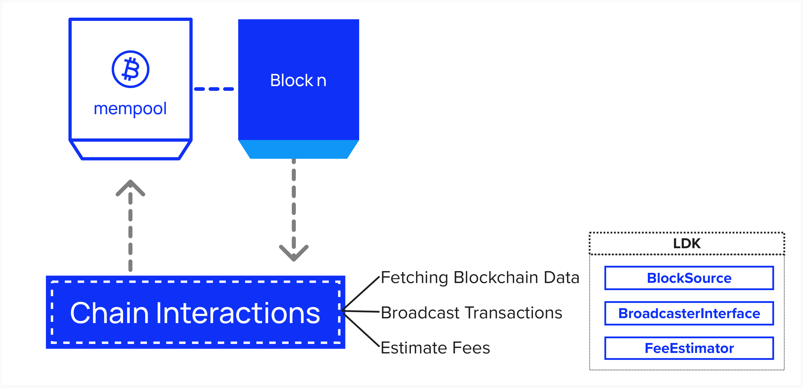
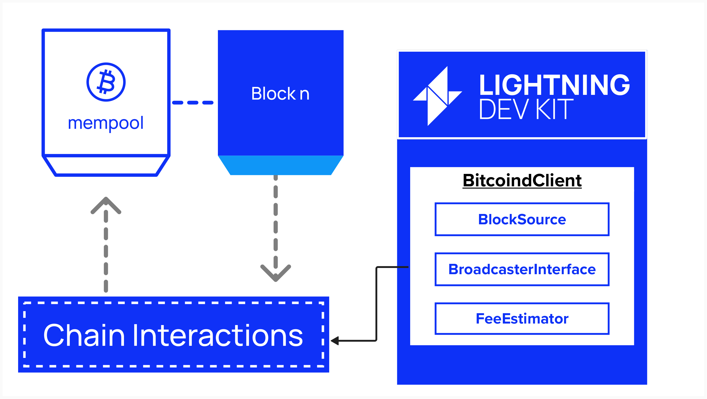

# Connecting To The Bitcoin Blockchain

Before we can get to complex Lightning Network functionality, let's begin by anchoring our node to the Bitcoin blockchain. After all, as we learned in the intro section, we'll start our Lightning journey by publishing a funding transaction in the Bitcoin blockchain.

<p align="center" style="width: 50%; max-width: 300px;">
  
</p>

#### Question: What specific tasks or functions will our Lightning node need to perform when interacting with the Bitcoin blockchain?

<details>
  <summary>
    Answer
</summary>

As we just learned, the backbone of Lightning is a fairness protocol. Two parties agree to exchange bitcoin transactions off-chain, but transactions can be published to the chain if a given party needs to enforce the fairness protocol.

There are many answers to this question. Below are a few:
- Broadcasting transactions
  - Channel funding
  - Channel closing
  - Commitment / HTLCs
  - Justice (punishment)
- Monitoring blocks and transactions
  - Identify when funding transaction is mined (with ***x*** confirmations)
  - Spot if channel party attempts to publish an old state
- Fee Estimation
  - Via Bitcoin RPC `getmempoolinfo`

</details>

## Motivating Example

Let's start with a motivating example to help us really understand why a Lightning Node is to tightly integrated into the Bitcoin Blockchain **and** what functionality our node will need to be able to execute.

Take a look at the picture below. Imagine you're the Lightning node in the middle, and you're routing two HTLCs from the node on your left to the node on your right. For the advanced reader, these are simple Lightning commitment transactions - no anchor outputs. Now, imagine you need to force close these commitment transactions immediately. You can assume that we have not recieved the primage, so we won't be attempting to spend from the preimage path on our commitment transaction with Node A.

If you recall from the "Intro" section of this course, some of these outputs have spending paths that you need to claim! After looking at the below transaction, try answering the two questions below:
1) **How many outputs do we need to claim?**
2) **What is the minimum number of transactions you will need to publish on-chain to move *all* funds to outputs that you unilaterally control? You can assume a best-case scenario where neither channel partner is trying to attack your outputs.**

<p align="center" style="width: 50%; max-width: 300px;">
  
</p>

<details>
  <summary>
    Answer
</summary>

**Question 1: How many outputs do you need to claim?**
If we assume that we never recieved the preimages for these HTLCs, then we'd need to claim the following **six** outputs:
- The two `to_local` outputs for both commitment transactions.
- The two `HTLC` outputs on the commitment transaction between us and Node B. Remember, we're timing out these outputs and clawing back these funds.
- We'll claim the outputs on the two `HTLC` timeout transactions.

**Question 2: What is the minimum number of transactions you will need to publish on-chain to move *all* funds to outputs that you unilaterally control?**
If we assume that we never recieved the preimages for these HTLCs, then we'd to publish the following **four** transactions. Note: technically you may be able to consolidate the HTLC timeout transactions, but we'll assume they are not conolidated, which is what the diagram shows.
- The commitment transaction between us and Node A.
- The commitment transaction between us and Node B.
- The two `HTLC` timeout transactions.

<p align="center" style="width: 50%; max-width: 300px;">
  
</p>

Hopefully, the above example has provided an even deeper intuition as to how closely integrated our on-chain and off-chain capabilities will need to be!

</details>


## Lightning Node Blockchain Interfaces

As we saw in the motivating example above, a Lightning node will need to perform a variety of on-chain operations such as:
- Fetching Blockchain Data
- Broadcasting Transactions
- Estimating Fees

We'll cover these one-by-one in the next few sections, implementing helper functions and getting some help from LDK along the way.

## Connecting to Bitcoin

First, we'll need to decide how we're going to interact with the Bitcoin blockchain. For this workshop, we'll interface with Bitcoin via the Bitcoin Core instance that we have running in the background of our Repl. If you completed the intro section of this workshop, you've already gotten some hands-on experience publishing transactions and fetching blockchain data from Bitcoin Core via the command line. In the next few exercises, we'll move implement that functionality (and more!) in Rust so that our Lightning node can also interface with Bitcoin Core.

That said, it should be noted that there are other ways your Lightning node can interface with the Bitcoin blockchain. For example, if you're running on a resource constrained machine, such as a mobile device, you may want to use an Esplora or Electrum server, which provide HTTP and RPC interfaces, respectively, to interact with Bitcoin. LDK provides support for all these architectural approaches. For a quick hands-on example of how an Esplora API would work, open up a new webpage and try typing the below into the search bar. This will call an Esplora endpoint, hosted by Blockstream, that returns the hash of the latest block.

```
https://blockstream.info/api/blocks/tip/hash
```

### Defining Our Bitcoin Interface

Let's get to work! We'll start by defining a `struct` in Rust called `BitcoinClient`. In Rust, a struct is a custom data type that groups together related data and functionality - conceptually similar to a `class` in Python. Our `BitcoindClient` will act as the central hub for all interactions with Bitcoin Core. As we'll shortly see, it will implement specific functionality that LDK requires to run a Lightning node. This design keeps our code modular, maintainable, and aligned with LDK’s architecture.

<p align="center" style="width: 50%; max-width: 300px;">
  
</p>

If you open `bitcoin_client.rs`, you'll see the `BitcoinClient` `struct` is defined for you. It will store important information that is relevant to our Bitcoin Core RPC connection. Most of the fields you see below should be familiar to you, but it's worth decribing two for additional clarity:
- `bitcoind_rpc_client`: This must be an `RpcClient` type, which is an implementation of a Bitcoin Core RPC interface that has many useful methods for us.
- `handle`: This isn't that important to our workshop, but for the curious learner, the handle allows our `BitcoinClient` to spawn asyncronous tasks during it's normal operations. This is important, as Lightning nodes will handle many operations concurrently.

```rust
pub struct BitcoinClient {
    pub(crate) bitcoind_rpc_client: Arc<RpcClient>,
    network: Network,
    host: String,
    port: u16,
    rpc_user: String,
    rpc_password: String,
    pub handle: tokio::runtime::Handle,
}
```

### Instantiating Our Bitcoin Interface

Now that we've defined the structure for our `BitcoinClient`, we should probably start implementing some functionality!

The first function we'll implement is the `new` **constructor**. A constructor is similar to a method, in that they're both functions, but a constructor is a special funtion that initializes a new instance of a type. You can think of this as function as similar to the `__init__` function of a Python Class.

Our `new` constructor will define the RPC endpoint to our Repl's Bitcoin Core and then return an instance of `BitcoinClient`. You can see the overall structure and flow of the function below.

```rust
impl BitcoindClient {
    pub(crate) async fn new(
        host: String, port: u16, rpc_user: String,
        rpc_password: String, network: Network,
    ) -> std::io::Result<Self> {

        // define http endpoint

        // define rpc credentials 

        // create a new RpcClient

        // make an RPC call to Bitcoind to ensure our connection is working properly
        // raise error if we cannot connect

        // create instance of BitcoindClient

        // return BitcoindClient
    }
}
```

## ⚡️ Implement the `new` constructor For Our `BitcoindClient`

For this exercise, we'll implement a `new` constructor for our `BitcoindClient`. This constructor will initialize a new instance with the necessary configuration to communicate with our Bitcoin node. We'll later pass this instance to various LDK components that need access to the blockchain, fee estimation, and transaction broadcasting functionality. We haven't created that functionality just yet, but we will soon!

To do this, we'll have to complete the following steps:
1) **Define an HTTP Endpoint**
    - [HttpEndpoint Rust Docs](https://docs.rs/lightning-block-sync/latest/lightning_block_sync/http/struct.HttpEndpoint.html)
2) **Define RPC credentials**
    - Credentials should be a base64 encoding of a user name and password joined by a colon.
3) **Create a new RPC Client**
    - [RpcClient::new Rust Docs](https://docs.rs/lightning-block-sync/latest/lightning_block_sync/rpc/struct.RpcClient.html#method.new)
4) **Make test RPC call**
    - [RpcClient call_method Rust Docs](https://docs.rs/lightning-block-sync/latest/lightning_block_sync/rpc/struct.RpcClient.html#method.call_method)
5) **Return instance of Bitcoin Client**

If you're familiar with Rust, helpful documentation/hints have been provided below each step. If you're not very familiar with Rust, the below helper functions are available to you:


```rust
fn get_http_endpoint(host: &String, port: u16) -> HttpEndpoint {
    // creates HttpEndpoint object with given host and port
}
```

```rust
fn format_rpc_credentials(rpc_user: &String, rpc_password: &String) -> String {
    // creates rpc credentials string in required format
}
```

```rust
fn new_rpc_client(rpc_credentials: &String, http_endpoint: HttpEndpoint) -> RpcClient {
    // creates new rpc client
}
```

```rust
async fn test_rpc_call(bitcoind_rpc_client: &RpcClient) -> std::io::Result<BlockchainInfo> {
    // makes a test "getblockchaininfo" RPC call to Bitcoin Core
}
```
**You should be good-to-go! Try implementing the `new` constructor in ```src/ch2_setup/exercises.rs```**! Click `Run` at the top of the Replit when you're done to see if the test `test ch2_setup::test::test_new_bitcoind ...` passes.
```rust
impl BitcoindClient {
    pub(crate) async fn new(
        host: String, port: u16, rpc_user: String,
        rpc_password: String, network: Network,
    ) -> std::io::Result<Self> {

        // define http endpoint

        // define rpc credentials 

        // create a new RpcClient

        // make an RPC call to Bitcoind to ensure our connection is working properly
        // raise error if we cannot connect

        // create instance of BitcoindClient

        // return BitcoindClient
    }
}
```

#
#
#
#
#
#
#
#
#
#
#
#
#
#
#
#
#
#
#
#
#
#

For this portion of the workshop, we'll focus on configuring our Lightning node so that it can fetch blockchain data. Since we have Bitcoin Core running in the background of this Repl, we'll program our node to interact with Core using Remote Procedure Calls (RPC). If you're familiar with sending a GET or POST request to an API, then an RPC call will feel very similar.

To properly run a Lightning node, there are a few 
interface with Bitcoin Core via . that it can retrieve and process blockchain data, such as new blocks and/or confirmed transactions. This information is neccessary so that we can successfuly maintain channel states and monitor for relevant on-chain activity.

Within LDK, we can think of each of these tasks as an **interface** - called a "trait" in Rust. In the domain of software engineering, an interface **defines a set of methods that a structure must implement**. *The structure does not implement these methods itself*. In other words, LDK will provide a template structure for each of the above functionalities, and it is up to the developer to decide how to implement the functionality.

The benefit of this is that is provides a lot of flexibility and customization to the developer. For instance, the developer can decide where they would like to source blockchain data from - a full node, esplora server, etc. Over the next few exercises, we'll see just how great this added flexibiltiy can be.

Now that we've reviewed some of the functionality we're going to need to implement, let's see which LDK interfaces are available to us.

- **BlockSource**: This trait defines methods to retrieve block and header data from a blockchain source. It's up to the developer to specify where this data is sourced from (full node, esplora server, etc.).
- **BroadcasterInterface**: This trait defines a method for broadcasting transactions. Since LDK does not know, by default, how LDK is interacting with the blockchain, the developer must implement their prefered method of broadcasting transactions (ex: RPC call to full node, third party API call, etc.).
- **FeeEstimator**: This trait defines a method for estimating bitcoin feerates. It takes a `ConfirmationTarget` as an input, which well discuss in more detail later. For now, it's sufficient to know that this defines various priorities for which we'd like a transaction to be confirmed. These are defined by LDK, and our implementation of the `FeeEstimator` must provide a feerate for each `ConfirmationTarget`.

<p align="center" style="width: 50%; max-width: 300px;">
  
</p>

## Fetching Blockchain Data

For this portion of the workshop, we'll focus on configuring LDK so that it can retrieve and process blockchain data, such as new blocks and/or confirmed transactions. This information is neccessary so that we can successfuly maintain channel states and monitor for relevant on-chain activity.

Below is a diagram depicting a few imporant data types that our node will need to be able to retrieve from the Bitcoin blockchain.

1) Block Height
2) Block Data (Header + Transactions)
3) Block Hash

<p align="center" style="width: 50%; max-width: 300px;">
  
</p>

### BlockSource

To aid in retrieving this information, LDK provides a `BlockSource` interface with the required methods that must be implemented by the developer.

```rust
pub trait BlockSource: Sync + Send {
    // Required methods - need to be implemented by the user
    fn get_header<'a>(
        &'a self,
        header_hash: &'a BlockHash,
        height_hint: Option<u32>,
    ) -> AsyncBlockSourceResult<'a, BlockHeaderData>;

    fn get_block<'a>(
        &'a self,
        header_hash: &'a BlockHash,
    ) -> AsyncBlockSourceResult<'a, BlockData>;

    fn get_best_block<'a>(
        &'a self,
    ) -> AsyncBlockSourceResult<'_, (BlockHash, Option<u32>)>;
}
```
As mentioned above, developers have the option to build a custom blockchain interface. If they choose to do this, they will need to manually parse blockchain data and notify LDK components such as `ChannelManager` and `ChainMonitor` that new blocks have been connected or disconnected. We'll learn more about these interfaces later!

To assist with this, LDK provides a sample implementation of the `BlockSource` in `lightning-block-sync` utility. This implemenation retrieves Bitcoin data by querying Bitcoin Core's JSON RPC interface. Since we have a Bitcoin Core node running in the background of this Repl, we'll be using the implementation provided by LDK.


### Defining BitcoindClient

Since we’ll be implementing multiple interfaces that interact with Bitcoin Core, we’ll create a `BitcoindClient` structure to consolidate these interactions.

In Rust, a struct is a custom data type that groups together related data and functionality. Our `BitcoindClient` will act as the central hub for all interactions with Bitcoin Core, implementing the necessary traits like `BlockSource`, `FeeEstimator`, and `BroadcasterInterface`. This design keeps our code modular, maintainable, and aligned with LDK’s architecture.

<p align="center" style="width: 50%; max-width: 300px;">
  
</p>

We’ll start by defining our `BitcoindClient` struct. This struct will serve as the foundation for our custom Bitcoin Core client. In addition to implementing the interfaces we discussed (`BlockSource`, `FeeEstimator`, and `BroadcasterInterface`), it will also store important information related to our connection to Bitcoin Core, such as network configuration and credentials.

```rust
pub struct BitcoindClient {
    pub(crate) bitcoind_rpc_client: Arc<RpcClient>,
    network: Network,
    host: String,
    port: u16,
    rpc_user: String,
    rpc_password: String
}
```
We can now implement all the required methods form the `BlockSource` trait by delegating to the corresponding methods in our `bitcoind_rpc_client`.

## ⚡️ Implement `BlockSource` For Our `BitcoindClient`
Complete the implementation of `BlockSource` for `BitcoindClient`. You'll need to implement:

1. `get_header`: Fetches a block header by its hash
2. `get_block`: Fetches a complete block by its hash
3. `get_best_block`: Fetches information about the most recent block

### Available Methods

You have access to `self.bitcoind_rpc_client` which provides these RPC methods:
- `get_header(header_hash, height_hint)` - Returns block header data
- `get_block(header_hash)` - Returns full block data
- `get_best_block()` - Returns the latest block info

Below is some code to get you started. You’ll notice that the following code has been provided for you within each function:

```rust
Box::pin(async move { 
    // your code here
})
```
This is included because our function is asynchronous, and at compile time, we don’t know the size of the data it will eventually return. To handle this, we “box” the future to give it a fixed size and “pin” it in the heap to ensure its memory location remains stable.

While understanding this concept is important for asynchronous programming in Rust, it’s not essential for completing this workshop. Therefore, this code has been provided for you.
```rust
impl BlockSource for BitcoindClientExercise {
    fn get_header<'a>(
        &'a self, header_hash: &'a BlockHash, height_hint: Option<u32>,
    ) -> AsyncBlockSourceResult<'a, BlockHeaderData> {
        Box::pin(async move { 
            // your code here
        })
    }

    fn get_block<'a>(
        &'a self, header_hash: &'a BlockHash,
    ) -> AsyncBlockSourceResult<'a, BlockData> {
        Box::pin(async move {
            // your code here
        })
    }

    fn get_best_block(&self) -> AsyncBlockSourceResult<(BlockHash, Option<u32>)> {
        Box::pin(async move { 
            // your code here
        })
    }
}
```