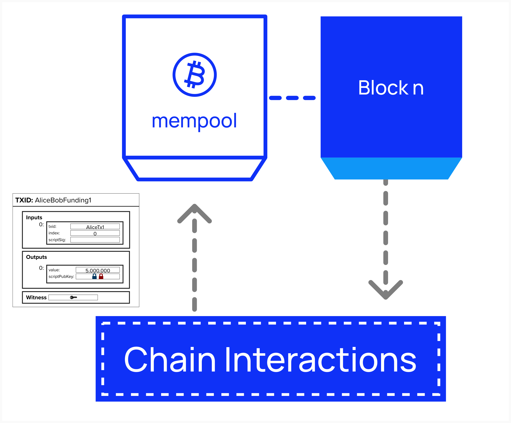

# Broadcasting Transactions To Chain

At this point, we've implemented the functionality to retrieve information from the Bitcoin blockchain. However, we still don't have a way to broadcast new transactions to the network. Without that capability, we'll have a pretty hard time opening Lightning channels!

<p align="center" style="width: 50%; max-width: 300px;">
  
</p>

## BroadcasterInterface
As we discussed previously, LDK provides interfaces which define methods that need to be implemented by the developer. `BroadcasterInterface` is one such interface, and it provides one method, `broadcast_transactions`. Here, again, we see the modularity and customizability of LDK. The developer can implement their preferred method for broadcasting transactions, and LDK will leverage that internally whenever it needs to broadcast a transaction for us.

For this workshop, we'll configure LDK to broadcast transactions using Bitcoin Core's `sendrawtransaction` method. If a developer did not have access to Bitcoin Core, they could use Esplora's [POST /tx](https://github.com/blockstream/esplora/blob/master/API.md#post-tx) endpoint instead.

```rust
pub trait BroadcasterInterface {
    // Required method
    fn broadcast_transactions(&self, txs: &[&Transaction]);
}
```

The `broadcast_transactions` method takes one or more `Transaction` types and broadcasts them to the chain. We saw the `Transaction` structure earlier in this workshop, but, as a reminder, this is what it looks like.

```rust
pub struct Transaction {
    pub version: Version,
    pub lock_time: LockTime,
    pub input: Vec<TxIn>,
    pub output: Vec<TxOut>,
}
```

## ⚡️ Implement `BroadcasterInterface` On Our `BitcoinClient`
To enable our Lightning node to broadcast transactions, we need to implement the `BroadcasterInterface` trait. Since we’ve already defined a `BitcoinClient` structure to manage our RPC connection to Bitcoin Core, we’ll extend its functionality by implementing the `BroadcasterInterface` trait for it.

We can do that by using the below notation:

```rust
impl BroadcasterInterface for BitcoindClient {
    fn broadcast_transactions(&self, txs: &[&Transaction]) {
        // loop over transactions
            // convert Transaction to hex
            // send raw transaction
}
```

### Hints & Helpful Information

### ○ For Loops
For this exercise, you will need to iterate over the array of `Transaction`s and broadcast each one. To iterate over an array in Rust, you can use the following syntax:

```rust
for num in arr {
  println!("{num}"); 
}
```

### ○ Convert `Transaction` to Hex
Before passing the `Transaction` into `sendrawtransaction`, you will need to convert it to Hex (string). You can do that by passing the transaction into the `serialize_hex` method provided in the **rust bitcoin** crate’s `encode` module.

```rust
let tx_hex = encode::serialize_hex(tx);
```

### ○ `sendrawtransaction` Helper Function
The below helper function has been provided to you. As you can see, it takes a transaction, represented as a hexadecimal string, converts it to JSON, and passes it as a parameter to the method `sendrawtransaction`.

Under normal circumstances (outside of a workshop setting), a developer would ikely write the below code within the `broadcast_transactions` function. However, this function makes use of some more complicated Rust components such as spawning asyncrhonous tasks, error handling, and cloning variables. We'll learn more about these later, but this helper function is meant to remove these complexities for those who do no come from a Rust background. 


Below is a helper function provided for you. It takes a transaction as a hexadecimal string, wraps it in JSON (as required by Bitcoin Core’s RPC), and sends it to the `sendrawtransaction` method to broadcast the transaction to the network.

Normally, a developer might write this logic directly inside the `broadcast_transactions` function, but that would involve trickier Rust concepts like asynchronous tasks, error handling, and cloning variables. We’ll cover some of those later in the workshop. For now, this helper simplifies things - especially if you’re new to Rust - so you can focus on the basics.


```rust
impl BitcoindClientExercise {
    fn sendrawtransaction(&self, tx_hex: String) {
        let bitcoind_rpc_client = self.bitcoind_rpc_client.clone();
        self.handle.spawn(async move {
            let tx_json = serde_json::json!(tx_hex);
    
            if let Err(e) = bitcoind_rpc_client
                .call_method::<serde_json::Value>("sendrawtransaction", &[tx_json])
                .await
            {
                eprintln!("Failed to broadcast transaction: {}", e);
            } else {
                println!("Successfully broadcasted transaction: {}", tx_hex);
            }
        });
    }
}
```

You can you `sendrawtransaction` by simply passing in a tx hex string like this:

```rust
self.sendrawtransaction(hex_string);
```