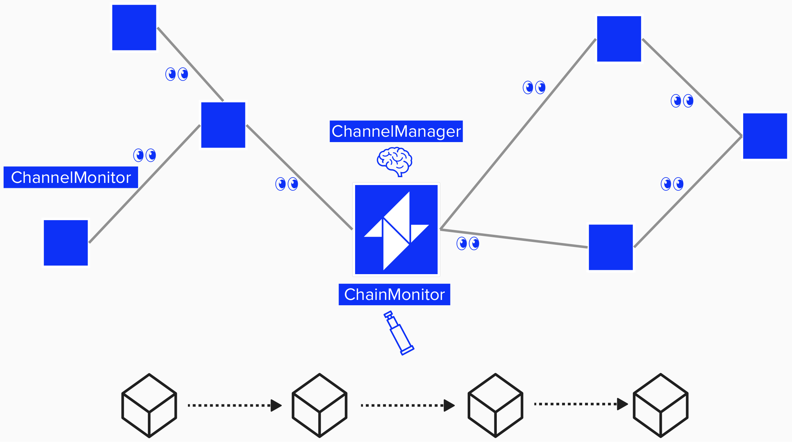

# Create A New BitcoindClient Instance

Now that we've implemented the required functionality for `BlockSource`, `FeeEstimator`, and `BroadcasterInterface`, we can begin to connect them to the **LDK components** that will utilize them. As a reminder, the `BlockSource`, `FeeEstimator`, and `BroadcasterInterface` are **interfaces (traits)** that the developer implements in a manner that is specific to their application needs.

Now that we've imlemented these traits, we can pass these interfaces as *parameters* into various LDK components. You can think of LDK components as a module that implements or manages a specific part of the Lightning protocol. It has clear responsibilities and even interacts with other LDK components. For example, a few LDK components that utilize the `BlockSource`, `FeeEstimator`, or `BroadcasterInterface` are listed below.

**This section needs work...**
- **ChannelManager**: This is the main logic hub for all channel-related activities. As needed, it will leverage the `BroadcasterInterface` in case it needs to broadcast transactions as part of channel operations (ex: force closure).
- **ChannelMonitor**: Each channel that your node has will recieve its own `ChannelMonitor`. The `ChannelMonitor` will monitor the blockchain for relevant events to your channel (such as your counterparty publishing an old commitment transaction) and it will broadcast on-chain transactions if necessary.
- The **ChainMonitor**: The `ChainMonitor` manages the `ChannelMonitors` and acts as a higher-level manager. For example, it will handle (---) and is in charge of persisting (saving) the data for each ChannelMonitor. As we'll see shortly, ensuring you have robust backups of each `ChannelMonitor` is crucial to Lightning Network security and keeping your funds safe.
  
**...this section needs work**

<p align="center" style="width: 50%; max-width: 300px;">
	
</p>

Before we can use our `BitcoindClient` with LDK components, we need to implement a constructor for it. While we've implemented the required traits (`BlockSource`, `FeeEstimator`, and `BroadcasterInterface`), we still need a way to create a new `BitcoindClient` instance with proper initialization. This instance can then be passed to the various LDK components that need these interfaces.


## ⚡️ Implement the `new` constructor For Our `BitcoindClient`

For this exercise, we'll implement a `new` constructor for our `BitcoindClient`. This constructor will initialize a new instance with the necessary configuration to communicate with our Bitcoin node. We'll later pass this instance to various LDK components that need access to the blockchain, fee estimation, and transaction broadcasting functionality.

We'll also implement sanity check RPC call to Bitcoin Core as part of the initialization. This will ensure that, each time we create a new instance, we know it's successfully able to communicate with Bitcoin Core.

To do this, we'll have to complete the following steps:
1) **Define an HTTP Endpoint**
	- [HttpEndpoint Rust Docs](https://docs.rs/lightning-block-sync/latest/lightning_block_sync/http/struct.HttpEndpoint.html)
2) **Define RPC credentials**
	- Credentials should be a base64 encoding of a user name and password joined by a colon.
3) **Create a new RPC Client**
	- [RpcClient::new Rust Docs](https://docs.rs/lightning-block-sync/latest/lightning_block_sync/rpc/struct.RpcClient.html#method.new)
4) **Make test RPC call**
	- [RpcClient call_method Rust Docs](https://docs.rs/lightning-block-sync/latest/lightning_block_sync/rpc/struct.RpcClient.html#method.call_method)
5) **Return instance of Bitcoin Client**

If you're familiar with Rust, helpful documentation/hints have been provided below each step. If you're not very familiar with Rust, the below helper functions are available to you:


```rust
fn get_http_endpoint(host: &String, port: u16) -> HttpEndpoint {
	// creates HttpEndpoint object with given host and port
}
```

```rust
fn format_rpc_credentials(rpc_user: &String, rpc_password: &String) -> String {
	// creates rpc credentials string in required format
}
```

```rust
fn new_rpc_client(rpc_credentials: &String, http_endpoint: HttpEndpoint) -> RpcClient {
	// creates new rpc client
}
```

```rust
async fn test_rpc_call(bitcoind_rpc_client: &RpcClient) -> std::io::Result<BlockchainInfo> {
	// makes a test "getblockchaininfo" RPC call to Bitcoin Core
}
```
**You should be good-to-go! Try implementing the `new` constructor in ```src/ch2_setup/exercises.rs```**! Click `Run` at the top of the Replit when you're done to see if the test `test ch2_setup::test::test_new_bitcoind ...` passes.
```rust
impl BitcoindClient {
	pub(crate) async fn new(
		host: String, port: u16, rpc_user: String,
		rpc_password: String, network: Network,
	) -> std::io::Result<Self> {
		
		// define http endpoint

		// define rpc credentials 

		// create a new RpcClient

		// make an RPC call to Bitcoind to ensure our connection is working properly
		// raise error if we cannot connect

		// create instance of BitcoindClient
		
		// return BitcoindClient
	}
}
```
