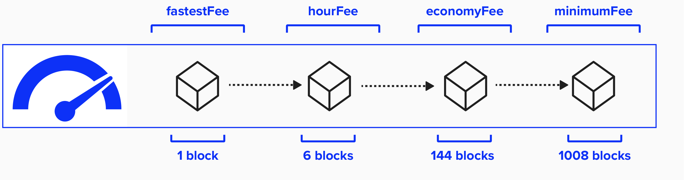

# Fee Estimation

Awesome - we now have a way to broadcast transaction to the Bitcoin blockchain. However, how does our node know what fee to set when broadcasting these transactions? This functionality is vital, as fees will impact how quickly a transaction is included in a block, which is very important in a time-sensitive system such as Lightning.

<p align="center" style="width: 50%; max-width: 300px;">
  
</p>


Below are a few situations in which our Lightning node will seek to broadcast a transaction to chain, can which feerate would you choose?

- Commitment transaction that supports anchor outputs
- Commitment transaction that does not support anchor outputs
- Coperative channel close
- Punishment transaction


## The FeeEstimator
LDK's `FeeEstimator` trait (seen below) is at the heart of fee estimation within LDK.

You'll notice that it has one required method, `get_est_sat_per_1000_weight`. This method is referenced throughout LDK to fetch feerate information when performing actions such as opening lightning channels, closing lightning channels, or sweeping funds on-chain. You'll also notice that the `get_est_sat_per_1000_weight` has one required input: a `ConfirmationTarget`.

```rust
pub trait FeeEstimator {
  /// Gets estimated satoshis of fee required per 1000 Weight-Units.
  fn get_est_sat_per_1000_weight(&self, confirmation_target: ConfirmationTarget) -> u32;
}
```

## The ConfirmationTarget
Remember how we decided which type of feerate to use in certain situation? LDK does something very similar. Specifically, LDK defines eight different types of feerate conditions, similar to what we did above when we decided which feerate to use various scenarios. The `ConfirmationTarget` choices are listed below with a brief explanation, but a detailed description of each `ConfirmationTarget` can be found [here](https://docs.rs/lightning/latest/lightning/chain/chaininterface/enum.ConfirmationTarget.html#).

| ConfirmationTarget                      | Description                                                                      |
|----------------------------------------|----------------------------------------------------------------------------------|
| MaximumFeeEstimate                     | The most aggressive (i.e. highest) feerate estimate available.|
| UrgentOnChainSweep                     | We have some funds available on chain which we need to spend prior to some expiry time at which point our counterparty may be able to steal them.        |
| MinAllowedAnchorChannelRemoteFee       | This is the lowest feerate we will allow our channel counterparty to have in an anchor channel in order to close the channel if a channel party goes away.      |
| MinAllowedNonAnchorChannelRemoteFee    | MinAllowedNonAnchorChannelRemoteFee   |
| AnchorChannelFee                       | This is the feerate on the transaction which we (or our counterparty) will broadcast in order to close the channel if a channel party goes away.                  |
| NonAnchorChannelFee                    | This feerate represents the fee we pick now, which must be sufficient to enter a block at an arbitrary time in the future.    |
| ChannelCloseMinimum                    | When cooperatively closing a channel, this is the minimum feerate we will accept. Recommended at least within a day or so worth of blocks.   |
| OutputSpendingFee                      | The feerate used to claim on-chain funds when there is no particular urgency to do so.                        |


## ⚡️ Implement `get_est_sat_per_1000_weight`
In `src/ch2_setup/fee_estimator_exercise`, you'll find the below function. Per the LDK specs, this function will take a `ConfirmationTarget` and return the estimated fee (in sats/KW) for the given ConfirmationTarget. Remember, sats/KW is the **satoshis-per-byte fee * 250**. It will then return the fee, formatted as a `u32`.

```rust
pub fn get_est_sat_per_1000_weight(confirmation_target: ConfirmationTarget) -> u32 {
}
```

The below helper function is available to you. 

```rust
fn fetch_fee_from_mempool() -> MempoolFeeRate {
}
```

This function will return hard-coded fee estimates, formatted in the same manner that mempool.space formats their feerate API. One approach to implementing this function would be to match these feerates with the required confirmation targets and return the associated fee (in sats/KW).

```rust
pub struct MempoolFeeRate {
  pub fastest_fee: u32,
  pub half_hour_fee: u32,
  pub hour_fee: u32,
  pub economy_fee: u32,
  pub minimum_fee: u32,
}
```