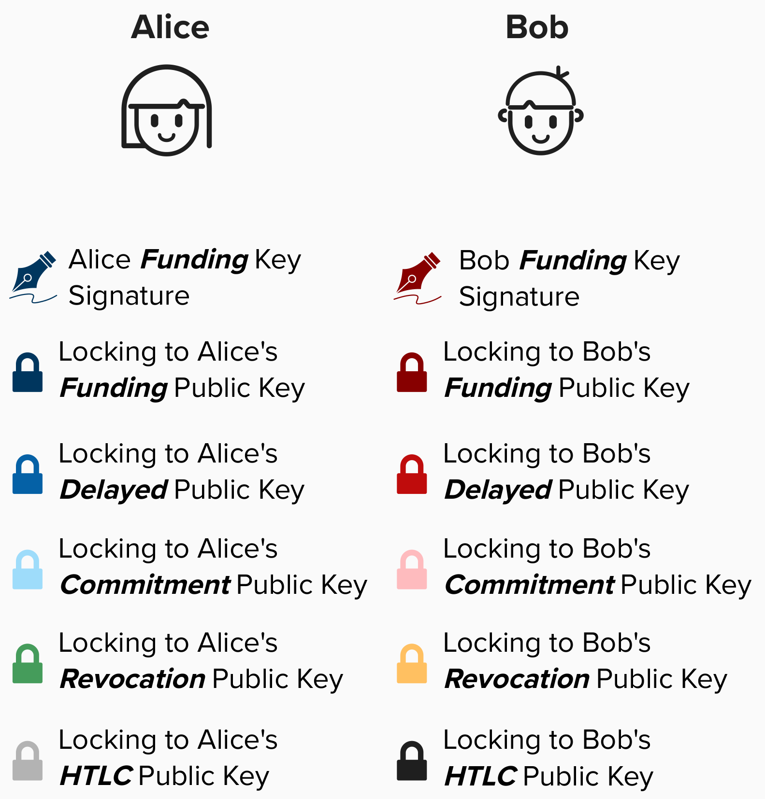

# HTLC & Transactions

Now that we've built our intuition around how HTLCs work, let's dive down to the transaction level to see how they are implemented. Imagine Alice is sending a 400,000 sat payment to Dianne through Bob and Charlie. Since Alice has a channel with Bob, Alice and Bob will begin by updating their respective commitment transactions to include a new output for the HTLC.

<p align="center" style="width: 50%; max-width: 300px;">
  
</p>

<p align="center" style="width: 50%; max-width: 300px;">
  
</p>

So far, much is still similar to the previous commitment transactions we looked at. For example:
- The ```to_local``` output for Alice and Bob still has two spending paths.
  - One spendable by the local node after ```to_self_delay``` blocks have passed.
  - The other spendable by the remote node if they have the revocation key.
- The ```to_remote``` output for Alice and Bob are still immediately spendable by the owner of those funds.

## HTLC Output
For the HTLC output, we have to come up with an output script that adheres to the HTLC contract rules. HTLC outputs will be slightly different depending on if you are ***offering*** the HTLC or if you are ***recieving*** the HTLC. 