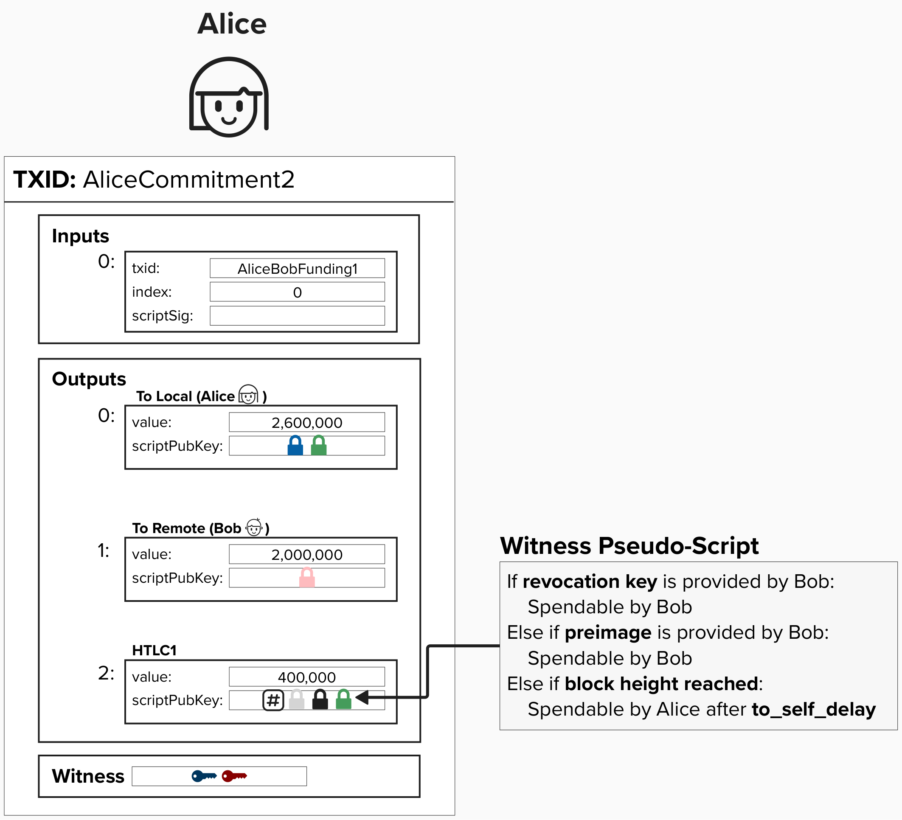
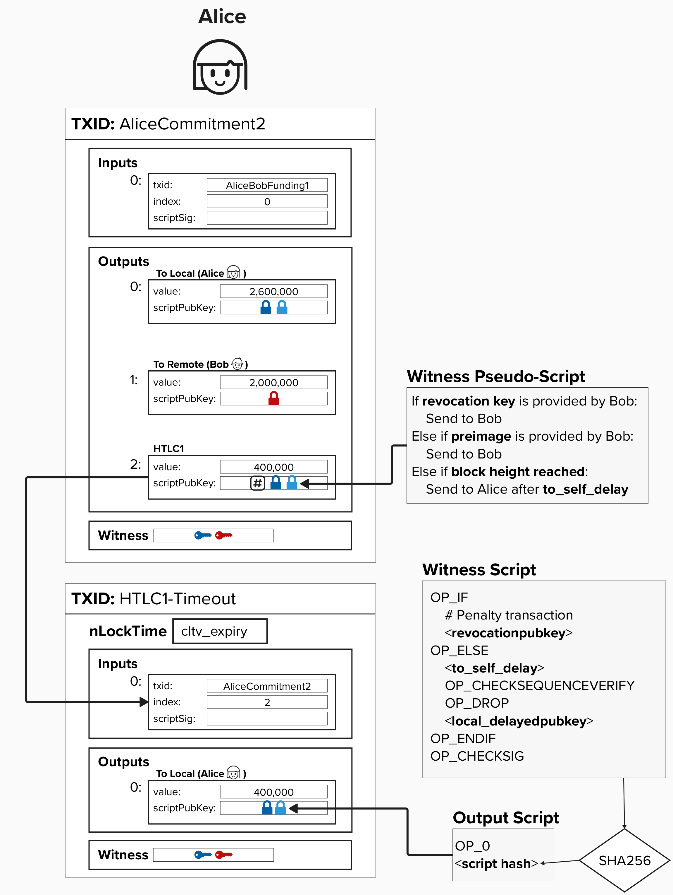
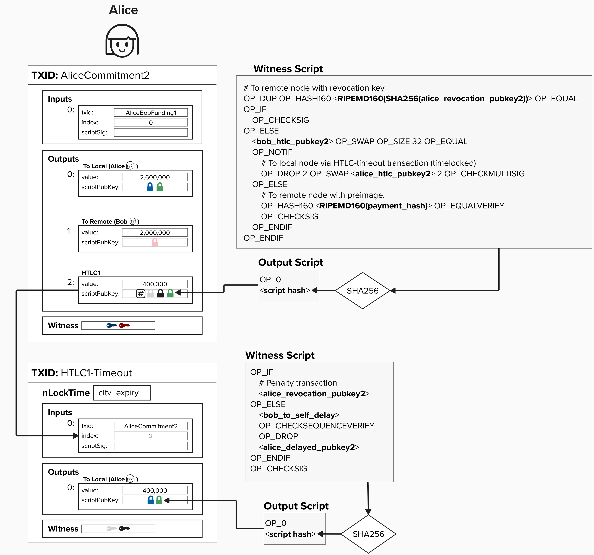

# HTLC Offerer

Alice, the HTLC offerer, has to create a transaction where: 
- Bob can spend the output if he can prove he has the preimage.
- Bob can spend the output if he has the revocation key. This protects Bob in the future if Alice attempts to publish this commitment transaction after they had agreed to move to a new channel state.
- Alice can spend (effectively, reclaim) the output if the HTLC expires. Remember, we propose a block height at which the HTLC must be completed by. So, if we pass the block height, specified in the field ```cltv_expiry```, then the HTLC has expired.


However, there is a bit of a dilema here! Alice's spending path must also be delayed by ```to_self_delay``` blocks to give the Bob time to sweep the funds if Alice attempts to cheat in the future. 


#### Question: Looking at the simplified transaction below, can you spot why this commitment transaction structure would be a problem?
<details>
  <summary>
    Answer
</summary>
Since the transaction is timelocked with ```cltv_expiry``` set to some block height in the future, the output cannot be spent until that block height has passed. This is meant to give Bob a specific timeframe for which he can retrieve the preimage and claim the funds. However, Alice must enforce a ```to_self_delay``` relative timelock on her ability to spend the output. This means, in the worst case, if Alice tries to spend this output after the ```cltv_expiry``` expires, she will still have to wait another ```to_self_delay``` blocks before she can spend that output. This effectively gives extra time to Bob to provide the preimage and spend this output to himself. Do you know how we can fix this?
</details>

<p align="center" style="width: 50%; max-width: 300px;">
  
</p>

## Addressing The Timelock Dilema
To fix this timelock dilema, we'll add a second transaction for Alice, known as the **HTLC Timeout Transaction**. This transaction will use the same script as our ```to_local``` output, however, it will feature the following key differences:
1) The transaction with have an ```nLocktime``` set to ```cltv_expiry```. This means that the transaction cannot be mined until the ```cltv_expiry``` block height has passed. Therefore, Alice cannot claim back her funds until the HTLC has expired.
2) The input for this transaction is the HTLC output on the commitment transaction.

Together, these changes allow for Alice to claim back her funds once the HTLC expires while also enforcing the ```to_self_delay``` in a manner that allows Bob to steal the funds via the revokation key, if needed. However, crucially, Bob can no longer claim the HTLC via the primage after it expires, since Alice can now publish and claim those funds exactly when the HTLC expires.


<p align="center" style="width: 50%; max-width: 300px;">
  
</p>


## Putting It All Together

Putting it all together, the HTLC output has the following spending conditions:

1) **Revocation Path**: If Bob holds the revocation key (in case Alice cheats by broadcasting an old transaction), he can immediately spend the output.
2) **Preimage Path**: If Bob provides the preimage, he can spend the output immediately.
3) **Timeout Path**: If Bob doesn't provide the preimage, Alice can spend the output via the HTLC Timeout Transaction, which is set up in advance with Bob's signature for the 2-of-2 multisig condition. This allows Alice to reclaim the funds after the cltv_expiry.

For the HTLC Timeout:
- **Revocation Path**: Bob can spend the output immediately with the revocation key.
- **To_self_delay Path**: Alice can spend the output after the to_self_delay.

<p align="center" style="width: 50%; max-width: 300px;">
  
</p>

## ⚡️ Write Function `build_htlc_offerer_witness_script` To Generate An HTLC Offerer Output Script

`build_htlc_offerer_witness_script` will take the following arguments:
- `revocation_pubkey160`: This is the HASH160 of the revocation public key. As a reminder, the HASH160 is calculated by first applying SHA256 to a public key and then applying RIPEMD160 to the result. This is represented as the `PubkeyHash` data type in Rust Bitcoin.
- `remote_htlc_pubkey`: This is the HTLC public key of our remote counterparty.
- `local_htlc_pubkey`: This is our HTLC public key.
- `payment_hash160`: This is the RIPEMD160 of the payment hash. Since the result of this is 20 bytes, it is represented as `&[u8; 20]`, a 20-byte array in Rust.

Below are a few```Builder``` functions that will use useful in this excercise.
<br/><br/>
* `Builder::new()` - construct a new builder object
* `.push_opcode(op)` - add an opcode to the script
* `.push_int(num)` - add a number to the script
* `.push_key(public_key)` - add a `PublicKey` to the script
* `.push_slice(public_key)` - add bytes, such as a `PubkeyHash` or array of bytes, to the script.
* `.into_script()` - return the resulting `Script` from the `Builder`  

```rust
fn build_htlc_offerer_witness_script(
    revocation_pubkey160: &PubkeyHash,
    remote_htlc_pubkey: &PublicKey,
    local_htlc_pubkey: &PublicKey,
    payment_hash160: &[u8; 20],
) -> ScriptBuf
```