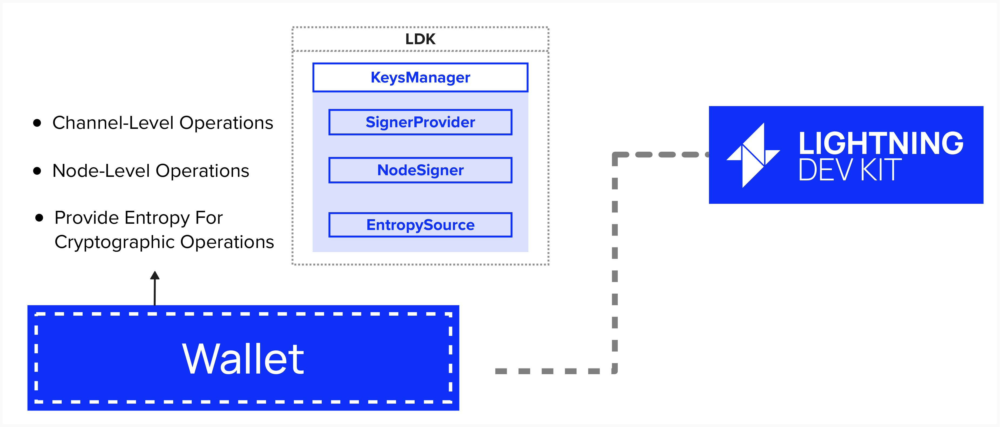
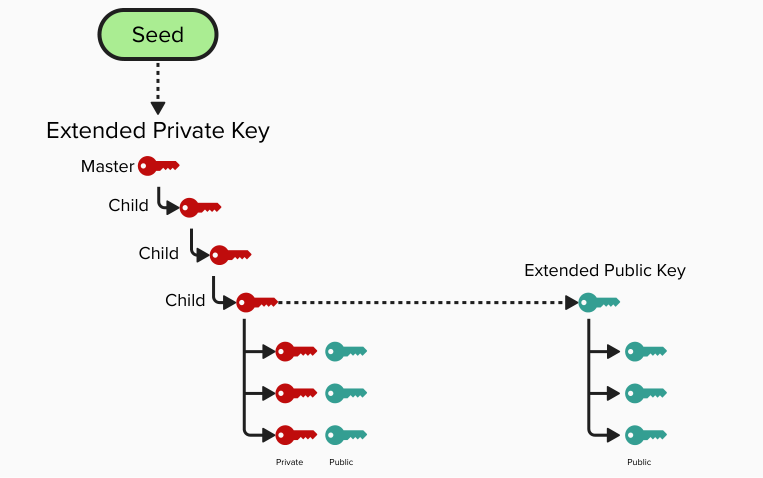
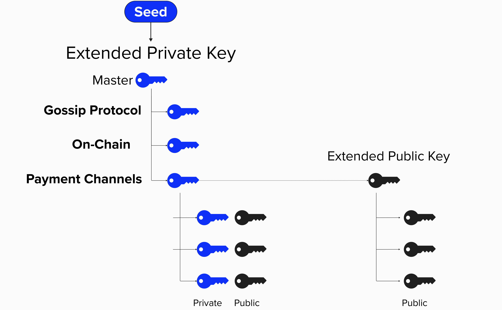
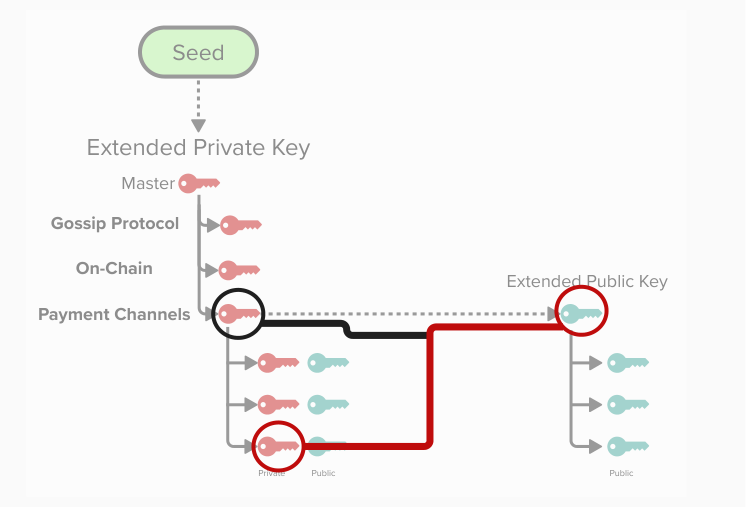
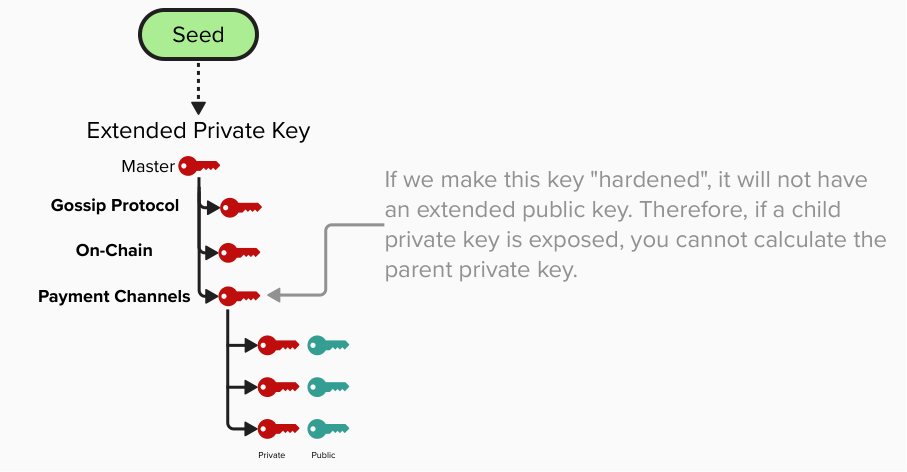
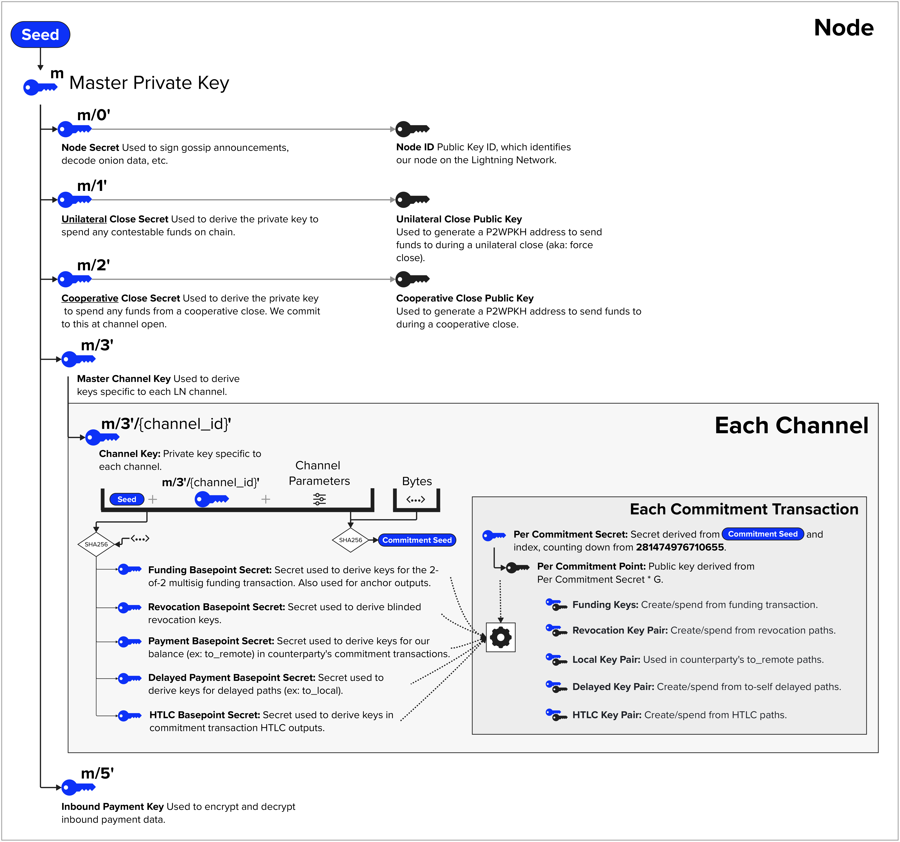

# LDK Wallet

Great, we've now implemented a few interfaces that will enable our node to interact with the Bitcoin blockchain, accomplishing tasks such as broadcasting transactions and processing incoming blocks as they are mined.

Another crucial interface we will need to implement is our wallet. Once implemented, it will provide

  

#### Question: What functionality will the wallet assist with for our node? Think of all the tasks a lightning node has to perform that involve keys.

  

    Answer

Our wallet will handle vital functionality for us, such as signing transactions, gossip messages, and managing the many keys that we're responsible for.

## LDK Key Management Interfaces

LDK provides a simple default `KeysManager` implementation for handing cryptographic operations at both the node-level (ex: signing gossip messages) and the channel-level (ex: generating child keys for each Lightning channel and signing commitment transactions). The `KeysManager` can be initialized with a 32-byte seed, which is used as a BIP 32 extended key.

For those who wish to further customize LDK's key management, the below traits are available to you. Also, note that the `KeysManager` interface will implement these traits for you by default.

- `NodeSigner`: Handles node-level operations such as signing gossip messages/invoices and generating shared secrets for encrypting onion messages.
- `SignerProvider`: Creates channel-specific signers and derives channel-specific keys. 
- `EntropySource`: Provides cryptographically secure random numbers for signatures and key generation. Developers who wish to implement their own random number generator algorithms or other customizations can implement the `EntropySource` trait themselves.

  

Remember when we opened our Lightning channel with Alice and Bob earlier? Remember how there were all those different keys within our various transaction output scripts? Well, all those keys (and more!) will be managed by the `KeysManager`.

  

Before we get too deep into the details and get our hands dirty implementing the `KeysManager`, let refresh our understanding of how we can safely and efficiently store multiple keys. To do this, we'll begin by reviewing **Bitcoin Improvement Proposal (BIP) 32**

## BIP 32

BIP 32  describes a **hierarchical deterministic** (HD) wallet structure that introduces the following characteristics to key management:
- **Single Source**: All public and private keys can be derived from a single seed phrase. As long as this single seed phrase is safely secured, you can re-derive the entire wallet.
- **Hierarchical**: All keys and addresses can be organized in a tree structure.
- **Deterministic**: All keys and addresses are generated the same exact way. Each time you restore you wallet from your seed, you'll get the exact same result.

  

This hierarchical strucuture can be quite useful. For example, in the below diagram, we've created new ***normal*** child private keys for the following tasks:
- **Gossip Protocol**: Sign gossip announcements, decode onion data, etc.
- **On-Chain**: Derive private and public keys which can be used to generate outputs that spend from payment channels that are closing such that we now unilaterally control those outputs.
- **Payment Channel**: Derive all of the public and private keys we need to operate a payment channel (ex: revocation key, htlc key, delayed key, etc.). Furthermore, each channel will have its own child key from this derivation path.

  

#### Question: Is there a problem with the above derivation construction? Specifically, should any of these child private keys use "hardened" keys?

  

    Answer

Yes, there is a big problem! Every ***normal*** child private key has an associated *extended public key* which can create a series of public keys for this private key. These public keys can be generated independently of the child private keys, which makes it safe to expose this to the public. 
  
However, if any child private key were to be accidentally leaked ***and*** the extended public key were known, then a bad actor could calculate the parent private key and, therefore, derive all child private keys at this level. This would mean that all of our channels would be at risk of being drained.

  

If, instead, we generate ***hardened*** child private keys, then there will be no associated extended public key. Therefore, if we leak one of our child private keys, only the funds on that specific channel are at risk. The rest of our channels are safe. To protect our LDK node and ensure that any private key leaks are isolated, LDK will derive hardened private keys in most situations.

  

  

#### Question: Imagine you're running a lightning node. What information needs to be backed up so that you're able to re-derive all of your keys and continue operating your node if it goes offline?

  

    Answer

- Seed
- Channel Parameters

