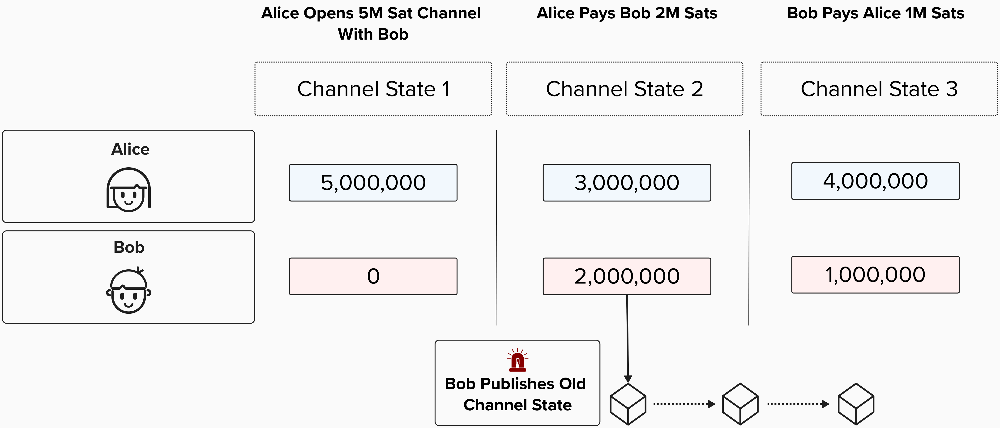
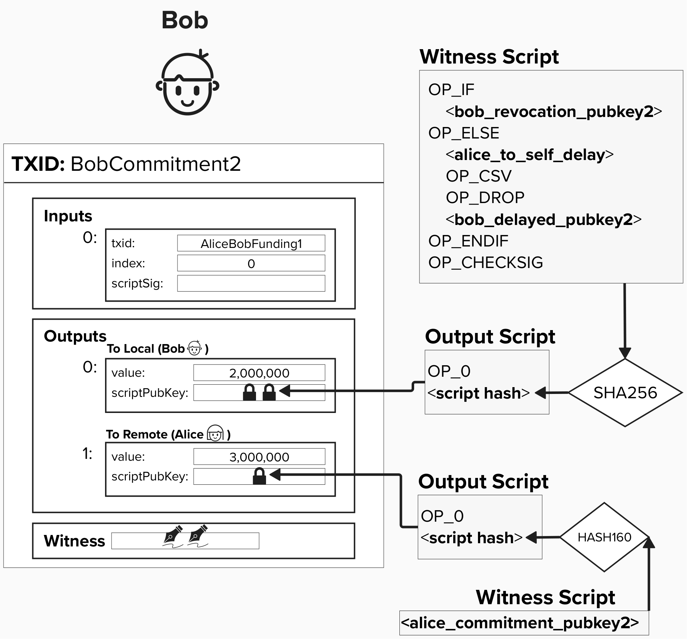

# Lightning Node Wallet

Great, we've now implemented a few interfaces that will enable our node to interact with the Bitcoin blockchain, accomplishing tasks such as broadcasting transactions and processing incoming blocks as they are mined.

Another crucial interface we will need to implement is our wallet. Once implemented, it will enable our node to perform a large variety of on-chain and off-chain tasks.


<p align="center" style="width: 50%; max-width: 300px;">
  
</p>

#### Question: What functionality will the wallet assist with for our node? Think of all the tasks a Lightning node has to perform that involve keys.

<details>
  <summary>
    Answer
</summary>

When it comes to building a Lightning node wallet, there is so much going on under the hood. While not an extensive coverage of all wallet functionaltiy, the below diagram does help contextualize a few situations where Lightning node will need to leverage keys. Let's review them, step by step.

1) **Gossip**: The Gossip Network is how nodes on the Lightning network communicate with eachother. For example, announcing their presence or informing the network that they have a new channel open and ready for use. When communicating this information, it's important that recipients of data can verify that the data came from the right person. Since every public node on the Lightning network advertises a public key to identify itself by, it can use the private key associated with this public key to sign messages, certifying that the message did, in fact, originate from them.
2) **Payments**: Before making a payment, you'd probably want to verify that it's going to the correct person, right? Of course! Within the Lightning network, payment invoices include signatures, produced by your Lightning node's off-chain wallet, to verify that the invoice originated from the right person.
3) **On-Chain Operations**: Recall our exercise from earlier where we reviewed force-closed two channels in the middle of routing a payment? All of those transactions needed to be broadcasted on-chain. Additionally, if those commitment transactions supported *anchor outputs*, we may have needed to bring additional UTXOs to add the necessary fees. This on-chain activity requires that our Lightning node have an integrated on-chain wallet. As we'll see, there are multiple ways we can go about that.
4) **Channel Management**: Channel Management includes the messages that are sent between nodes to communicate a change in state. For example, oppening a channel, adding a new HTLC, closing a channel, etc. When constructing new states, we're updating commitment transactions, which means we'll have to send a new signature to our peer for the commitment transaction. This signature, of course, is produced by our wallet.

<p align="center" style="width: 50%; max-width: 300px;">
  
</p>

</details>

## On-Chain Wallet Motivating Example
As we saw above, one crucial component of our Lightning Node is an **on-chain wallet**. To futher drive this point home, let's engage in another thought experiment!

Imagine Alice and Bob have an active Lightning channel. So far, they have achieved the below channel states. After advancing to state three and exchanging revocation keys, Bob decides to try to cheat Alice by publishing his commitment transaction from state two!

<p align="center" style="width: 50%; max-width: 300px;">
  
</p>

As a reminder, here is what Bob's commitment transaction would look like:

<p align="center" style="width: 50%; max-width: 300px;">
  
</p>

#### Question: How would we go about claiming all outputs on this transaction? Remember, we have the revocation key!

<details>
  <summary>
    Answer
</summary>

To stop Bob from cheating, we need to claim both our funds and his. We can do this by creating a new on-chain transaction that references these outputs and locks them to new outputs that are unilaterally controlled by us. In other words, the outputs on Bob's transaction will become the inputs on our transaction.

Also, note that we do have to act pretty quickly. Bob's `to_local` output is timelocked by `alice_to_self_delay`, which is relative block delay that Alice negotiates with Bob when setting up a channel. After this delay expires, Bob can claim this output himself, so we will have to act quicker and claim the output first.

While none of what we've just reviewed is necessarily new (it's covered in the Intro section of this workshop), it does emphasize the importance of on-chain and off-chain wallet integrate for our Lightning node. More specifically, to be able to punish Bob in a timely manner, we're going to need to be able to create, sign, and broadcast and on-chain transaction relatively quickly.

</details>

## Implementing Our On-Chain Wallet

Now that we've reviewed why an on-chain wallet is so important, let's go ahead and implement one for our Lightning node. 

Bitcoin Core comes with wallet functionality, so we'll configure our Lightning node to communicate with Bitcoin core via RPC. That said, since LDK is a modular API-driven Lightning implementation, developers have a lot of flexibility for how they'd like to integrate an on-chain wallet. For example, they could develop an on-chain wallet using Bitcoin Development Kit (BDK).

Since we're organizing our Bitcoin Core interfaces within the `BitcoinCore` structure we created, let's update that to add our new wallet functionality.

## ⚡️ Implement On-Chain Functionality For Our `BitcoinClient`

For this exercise, we'll implement on-chain transaction functionality within our `BitcoinClient`. This way, our Lightning node will be able to generate and broadcast an on-chain transaction when needed.

As we're building these functions, imagine we're creating a 2-of-2 funding transaction, as that would be an example of an **on-chain** transaction that our Lightning node will need to create, **using our on-chain wallet**. Reminder, we need to use our on-chain wallet because that wallet will be signing (unlocking) the on-chain UTXO that is funding this channel.

### ⚡️ Implement `create_raw_transaction`

We'll start with creating a raw transaction. To do this, we'll use Bitcoin Core's `createrawtransaction` RPC command. As an input, this function will take a hashmap (dictionary) of `address`: `amount` outputs, describing where the funds are being sent. You can read more about the other arguments that this RPC command takes [here](https://developer.bitcoin.org/reference/rpc/createrawtransaction.html).

This function will return a `RawTx` type, which is a `String`. Note, this transaction is not yet ready to broadcast, as it doesn't have inputs or a signature yet!

```rust
pub async fn create_raw_transaction(&self, outputs: Vec<HashMap<String, f64>>) -> RawTx {
    let outputs_json = serde_json::json!(outputs);
    self.bitcoind_rpc_client
        .call_method::<RawTx>(
            "createrawtransaction",
            &vec![serde_json::json!([]), outputs_json],
        )
        .await
        .unwrap()
}
```

### ⚡️ Implement `fund_raw_transaction`

As mentioned above, once we get our transaction hex back from `create_raw_transaction`, we will need to find inputs to use. To accomplish this, we can use the RPC command `fund_raw_transaction`. This command will take a transaction (in the form of a hex string) and return a signed transaction - also in the form of a hex string. You can read more about it [here](https://developer.bitcoin.org/reference/rpc/fundrawtransaction.html?highlight=fundrawtransaction).

Another important thing to note is that this RPC command will add, at most, one change output to the outputs.

```rust
pub async fn fund_raw_transaction(&self, raw_tx: RawTx) -> FundedTx {
    let raw_tx_json = serde_json::json!(raw_tx.0);
    let options = serde_json::json!({
        // LDK gives us feerates in satoshis per KW but Bitcoin Core here expects fees
        // denominated in satoshis per vB. First we need to multiply by 4 to convert weight
        // units to virtual bytes, then divide by 1000 to convert KvB to vB.
        "fee_rate": self
            .get_est_sat_per_1000_weight(ConfirmationTarget::NonAnchorChannelFee) as f64 / 250.0,
        // While users could "cancel" a channel open by RBF-bumping and paying back to
        // themselves, we don't allow it here as its easy to have users accidentally RBF bump
        // and pay to the channel funding address, which results in loss of funds. Real
        // LDK-based applications should enable RBF bumping and RBF bump either to a local
        // change address or to a new channel output negotiated with the same node.
        "replaceable": false,
    });
    self.bitcoind_rpc_client
        .call_method("fundrawtransaction", &[raw_tx_json, options])
        .await
        .unwrap()
}
```

### ⚡️ Implement `sign_raw_transaction_with_wallet`

Now that we have our transaction hex, complete with inputs and outputs, we're ready to add a signature. To do this, we'll need to call Bitcoin Core's RPC command `signrawtransactionwithwallet`. This command takes a transaction hex and returns a signed transaction, ready to be broadcasted.

```rust
pub async fn sign_raw_transaction_with_wallet(&self, tx_hex: String) -> SignedTx {
    let tx_hex_json = serde_json::json!(tx_hex);
    self.bitcoind_rpc_client
        .call_method("signrawtransactionwithwallet", &vec![tx_hex_json])
        .await
        .unwrap()
}
```

### ⚡️ Implement `send_raw_transaction`

We're almost there! Now, we'll implement `send_raw_transaction` so that our application can broadcast on-chain transactions.

At this point, you may be wondering: "Why do we need to implement `sign_raw_transaction_with_wallet`? Didn't we already implement a `BroadcastInterface`?".

Those would be great questions. In reality, LDK will broadcast the funding transaction for us (more on that later!). All we have to do is hand LDK the signed transaction. However, if we want to add additional broadcast functionality, then we will have this helper function available.

```rust
pub async fn send_raw_transaction(&self, raw_tx: RawTx) {
    let raw_tx_json = serde_json::json!(raw_tx.0);
    self.bitcoind_rpc_client
        .call_method::<Txid>("sendrawtransaction", &[raw_tx_json])
        .await
        .unwrap();
}
```