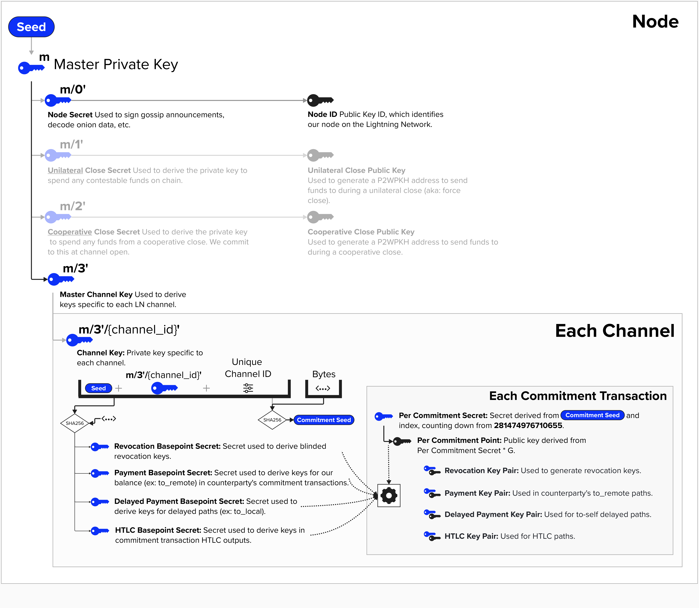

# ⚡️ Write Function `new_simple_key_manager` To Generate A Simple Key Manager

```rust
pub fn new_simple_key_manager(seed: [u8; 32]) -> SimpleKeysManager{
}
```

LDK provides a ```KeysManager``` structure to assist in key management and signing operations. We'll discuss this in more detail shortly, but, for this exercise, we'll impliment a simpler version, called the ```SimpleKeysManager```.

The ```SimpleKeysManager``` has the following structure:
```rust
struct SimpleKeysManager {
    pub node_secret: SecretKey,
    pub node_id: Secp256k1PublicKey,
    pub shutdown_pubkey: Secp256k1PublicKey,
    pub channel_master_key: Xpriv,
    pub channel_child_index: u32,
    pub seed: [u8; 32],
}
```

The `new_simple_key_manager` function will take a 32-byte ```seed``` as an input and return a ```SimpleKeysManager``` strucure that meets the above requirement types for each component. Also, ensure that derivation paths match the paths specified in the LDK BIP 32 diagram below.

<p align="center" style="width: 50%; max-width: 300px;">
  
</p>

To help you with completing this excercise, the following functions are available to you:

```rust
fn get_master_key(seed: [u8; 32]) -> Xpriv {
  // create master key from seed
}
```

```rust
fn get_hardened_child_private_key(master_key: Xpriv, idx: u32) -> SecretKey {
  // create hardened child private key from given master key and index
}
```

```rust
fn get_hardened_extended_child_private_key(master_key: Xpriv, idx: u32) -> Xpriv {
  // create hardened extended child private key from given master key and index
}
```

```rust
fn get_public_key(private_key: SecretKey) -> Secp256k1PublicKey {
  // create public key from private key
}
```

If you would like a hint, click below:
<details>
  <summary>Hint</summary>
  <br/>

Try implementing the following:

```rust
pub fn new_simple_key_manager(seed: [u8; 32]) -> SimpleKeysManager{

    // create master key

    // derive node secret

    // derive node id

    // derive shutdown private key

    // derive shutdown public key

    // derive channel extended private key

    // populate and return SimpleKeysManager
    SimpleKeysManager {
        node_secret: //,
        node_id: //,
        shutdown_pubkey: //,
        channel_master_key: //,
        channel_child_index: //,
        seed: //,
    }
  ```

</details>
