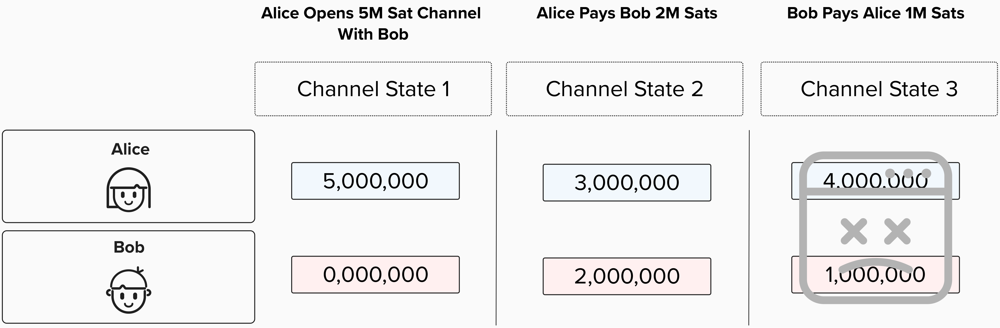
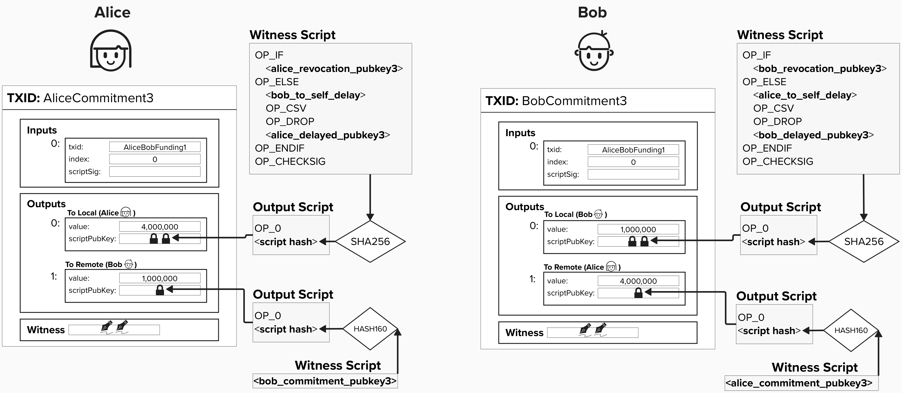
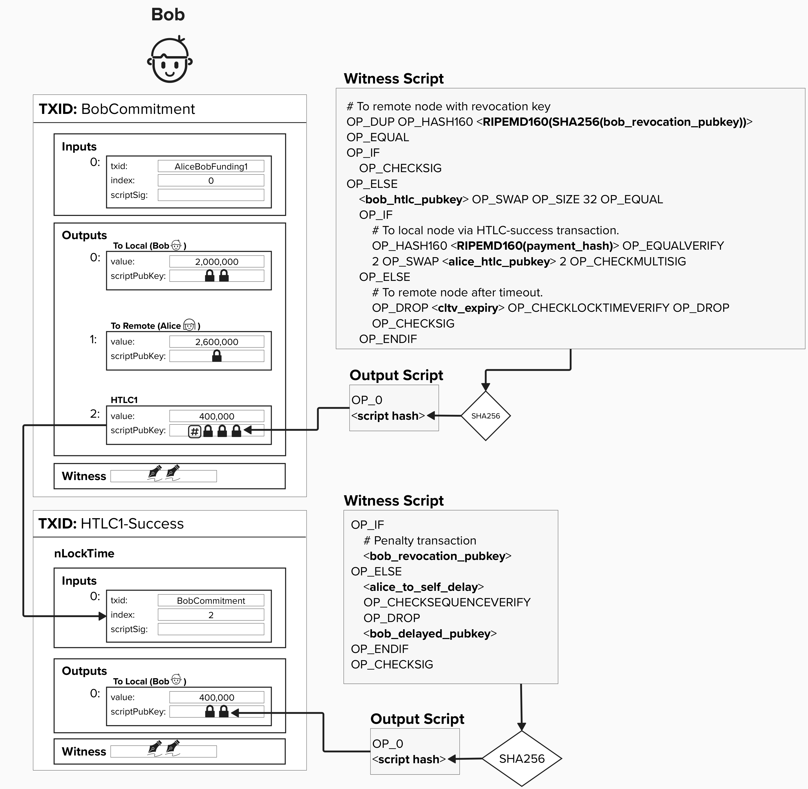
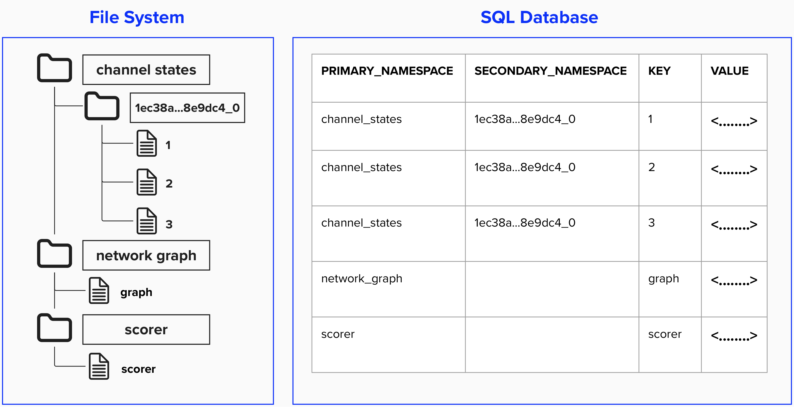

# Persisting Data

We're making great progress on building our node, however, we're missing an important step. If our node goes offline or crashes and we don't have data persisted, we're in BIG trouble.

<p align="center" style="width: 50%; max-width: 300px;">
  
</p>

## Persistence Motivating Examples
Below are a few motivating examples to help convey how crucial data persistance is.

### 1) Node Crash

Imagine we're Alice in the image below. Our node crashes after entering into the third channel state (oh no!). 

<p align="center" style="width: 50%; max-width: 300px;">
  
</p>

As you answer the below questions, keep Alice and Bob's commitment transactions from their 3rd state in mind:

<p align="center" style="width: 50%; max-width: 300px;">
  
</p>

#### Question 1: How can we rederive all of the keys for our channel states?

<details>
  <summary>
    Answer
</summary>

To regenerate all of the transactions for each state, we're going to need to be able to rederive all of the keys - both for Alice and Bob. 

Since we're Alice in this example, we can rederive our keys with our seed, since everything after that is determininistically coded in our node's software. That said, we will need to know how many channel states our node has advanced, as each channel state will generate its own unique keys using the **per-commitment secret**. As long as we know the index of the current channel state, we will be able to rederive our channel keys.

For Bob, however, we will need to store all of his keys over time, as we don't have the ability to regenerate them ourselves.

<details>
  <summary>
    Click here for a reminder of how keys are generated in LDK
</summary>

<p align="center" style="width: 50%; max-width: 300px;">
  
</p>

</details>

</details>

#### Question 2: What other channel state information do we need to store?


<details>
  <summary>
    Answer
</summary>

There are *many* answers here - some more obvious than others.

First and foremost, we'll have to be able to restore the transactions exactly as they were when we agreed upon them. This means the inputs, outputs, timelocks, and even fees need to be the exact same. Why? Because our counterparty gave us their signature for a specific transaction, and their signature will be invalid if we can't reconstruct the exact same transaction. Oh, on that note - we'll also need their signatures to properly restore the old channel state, so we better have that saved somewhere.

#### Bonues Question: Take a look at Bob's commitment transactions below. Let's assume Bob publishes this, but it's actually an old state. Which piece of data will you need to persist so that, even if your node crashes, you can punish Bob.

<p align="center" style="width: 50%; max-width: 300px;">
  
</p>

<details>
  <summary>
    Answer
</summary>

The preimage!

Remember, if Bob routed a payment through us earlier, that means we set up an HTLC for one of our channel states. The HTLC output for this channel state will have a preimage spending path. If we routed this payment, then we would have recieved this preimage.

So, if Bob is attempting to broadcast this old state, we're going to need to ensure that we still have this preimage so that we can spend from this HTLC path before Bob reclaims the funds via his timelocked path.

</details>

</details>

### 2) Routing

Imagine you've been running a node for a few months. You've gotten quite good - 95% success rate - nice job! What happens if your node crashes?

<p align="center" style="width: 50%; max-width: 100px;">
  
</p>

<details>
  <summary>
    Answer
</summary>

LDK treats routing like an optimization problem, and it learns over time how to *best* route a payment through the network. We'll learn more about this later, but, for now, it's sufficient to note that LDK will keep track of all failed and successful payments so that it can build a robust understanding of each channels capacity to route varying levels of satoshis. If we're not persisting this data over time, we'll have to start all over if our node crashes.

</details>


## Implementing Our Storage

Hopefully, we now understand just how important data persistance is. If our node crashes and we don't have our data persisted, we may lose all of our funds.

Let's fix that by build data storage capabilities for our Lightning node. To do this, we'll create a general **Key-Value** storage abstraction. This concept is very similar to a hash map or dictionary data structure. Each **key** will be unique, and it will serve as an identifier for some value (data) we are persisting.

Two major benefits of this design choice are the following:
1) **Universal Interface**: A Key-Value storage abstraction provides a simple interface to store any type of data that needs to be persisted. As we saw in our motivating example, this can be channel states, network graphs, or scoring information (used for identifying the ideal route).
2) **Implementation Flexibility**: By abstracting our persistance into a Key-Value interface, it becomes easier to change the storage solution without having to re-design our Lightning node's architecture.

### Organizing Our Keys

You may have read the above and thought: "Really, one large hash map (or dictionary)" for everything?". That would have been a great question! We'll add some organization to our Key-Value storage by adding **primary** and **secondary namespaces**. These will help organize our storage into separate sections and help avoid key collisions.

To show how **namespaces** and a **key-value** storage solution allows us to create a flexible persistance solution, look at the example storage solutions below.

One uses a **File System** to store data, while the other uses a **SQL Database**. Take a moment to compare the two solutions and verify that that are, in fact, storing the same data using the following strucutre:

```
primary_namespace / secondary_namespace / key / value
```

<p align="center" style="width: 50%; max-width: 100px;">
  
</p>

## Build A Key Value Storage

So, now that we have a framework for how our Lightning node will handle storage, let's begin implementing our storage solution! We'll use our Repl's internal file system to store our data.

We'll start off by defining a simple structure which will hold the path to where our storage location is. You'll see that `data_dir` is of type `PathBuf`. This data type is part of Rust's standard library, and it provides some useful methods for system paths such as `.parent()`, `.push()`, and `.file_name()`. You can read more about it [here](https://doc.rust-lang.org/std/path/struct.PathBuf.html).

```rust
pub struct FileStore {
  data_dir: PathBuf
}
```

Our `FileStore` already has a `new` constructor, which we've seen a few times now. It also has an internal function, `get_file_path`, which will create a `PathBuf` variable that points whichever `primary_namespace / secondary_namespace / key` location that we provide.

```rust
impl FileStore {
    pub fn new(data_dir: PathBuf) -> Self {
        Self { data_dir }
    }

    fn get_file_path(&self, primary_namespace: &str, secondary_namespace: &str, key: &str) -> PathBuf {
        let mut path = self.data_dir.clone();
        path.push(primary_namespace);
        if !secondary_namespace.is_empty() {
            path.push(secondary_namespace);
        }
        path.push(key);
        path
    }
}
```

### ⚡️ Implement `write` for our `FileStore`

Let's begin our storage journey by implementing a `write` function. This function will take the namespace and key information along with the data (value) to write to the provided location.

As you can see below, this function will return a `Result` type. This is important, as we will need to know if our write operation is successful or not so that we can act accordingly. From a Lightning context, we will want to program our Lightning node to *not* advance channel states unless updates are successfully persisted. The `Result` data type can help us do this.

```rust
impl FileStore {
  pub fn write(&self, primary: &str, secondary: &str, key: &str, data:&[u8]) -> lightning::io::Result<()> {
      let path = self.get_file_path(primary, secondary, key);
      let mut file = fs::File::create(path)?;
      file.write_all(data)?;
      Ok(())
  }
}
```
<details>
  <summary>
    Click for helpful Rust tips!
</summary>

This exercise will get us deeper into the Rust language. Hopefully, it's a great opportunity to learn about Rust, while also being easy enough to not be overwhelming.

Let's walk through completing this exercise, step by step.

#### Step 1: Get File Path
First, we'll need to get the file path to the provided location. Our `FileStore` was initialized with the `data_dir` as part of the `new` constructor, so it's aware of where the top-level folder is that stores all of our data. We also have an internal function available to us, `get_file_path`, which will create the `PathBuf` object for us. Let's use that to create a path variable.

```rust
let path = self.get_file_path(// add parameters here);
```

#### Step 2: Create File
Now that we have a variable that represents *where* we will save our data, we need to create a file at that location. We can do that using the **filesystem** (`fs`) module in Rust's standard library. Specifically, we'll use the following function:

```rust
let mut file = fs::File::create(path)?;
```

Notice the following two things above:
- `mut` keyword: Rust is a *statically typed* language, which means that we need to tell Rust the data type of *every* variable. Additionally, we need to inform Rust if the given variable's internal state will change over time. In other words, will the variable be **mutable** or not. Since we are just creating a file here and have *not yet* written the data, this variable is indeed mutable, as we will change its internal state once we write data to it!
- `?`: The `?` operator is an **error propogation operator**. We use this because the `fs::File::create` function returns an error, similar to our `write` function. Therefore, we need to catch this error, if one occurs, and return that immediately within our funciton. If there is no error, then the result will be assigned to the variable - in our case, `file`. This `?` operator is a shorthand to do all of the above. You can read more about it [here](https://doc.rust-lang.org/std/fs/struct.File.html#method.create).

#### Step 3: Write Data To File
Finally, we will need to write our data to the file. `fs::File::create` from Step 3 will return a `File` instance. In other words, our mutable variable `file`, will be a `File` type. This type has the following method that we can use to write data to the given file.

```rust
file.write_all(data)?;
```

Once again, you'll notice we use a `?` operator to ensure that we catch any error that occur.

#### Step 4: Return Ok!
If all goes well, we would have just completed writing data to our file system. Now, all we have to do is return `Ok(())`. We need to do this because our function, `write` expects a `Result` to be returned. `Result` is an `enum` which can either be:
- `Ok(<optional data>)`
- `Err(e)`

In other words, it expects to know if the function succeeded or failed, so we have to return `Ok(())` so that it knows we succeeded.

</details>