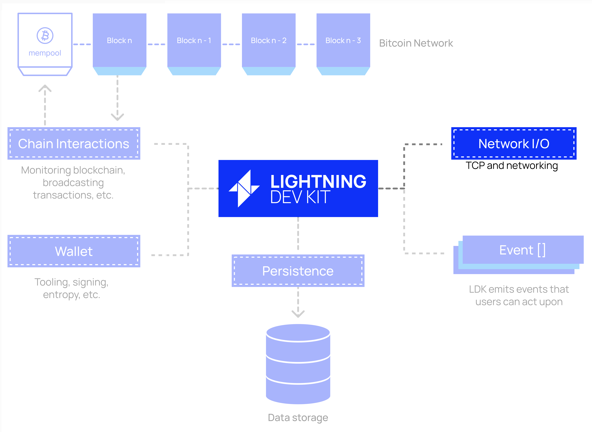
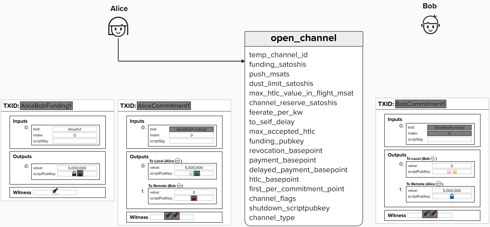
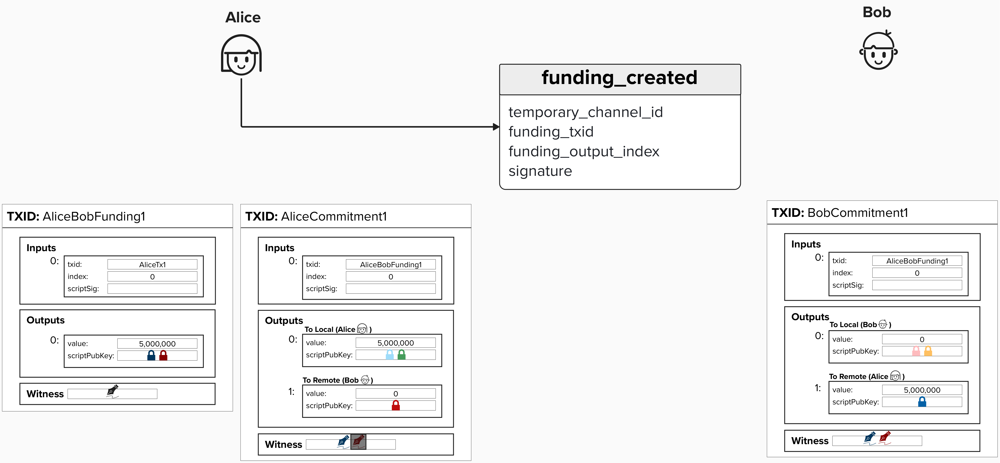
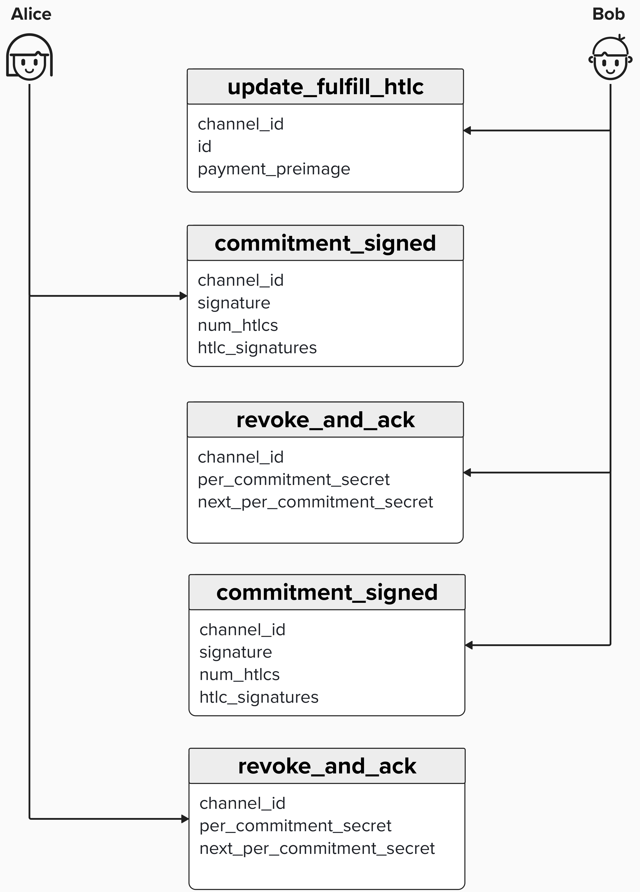

# Networking

So far, we've implemented quite a lot of important functionality for our node - sourcing blockchain data, publishing transactions, estimating fees, etc. That's all good fun, but Lightning is a team sport. There is no "I" in team, right? To properly experience the Lightning network, we'll need to communicate with others.

  

## Lightning Network Communication
Broadly speaking, our Lightning node will have to perform the following types of communication with other nodes:
- **Gossip**: The Gossip protocol, described in [BOLT #7: P2P Node and Channel Discovery](https://github.com/lightning/bolts/blob/master/07-routing-gossip.md), defines how Lightning nodes will inform each other of payment channels updates, including opening, closing, and updating channels.
- **Routing**: The Routing protocol, described in [BOLT #4: Onion Routing Protocol](https://github.com/lightning/bolts/blob/master/04-onion-routing.md), defines how Lightning nodes should package payment information such that it can be privately communicated across the network.
- **Channel Management**: The Peer to Peer Channel Management protocol, described in [BOLT #2: Peer Protocol for Channel Management](https://github.com/lightning/bolts/blob/master/02-peer-protocol.md), defines which messages peers should communicate to eachother to open, close, or update a payment channel.

We'll review each of these communication protocols during this workshop. As a sneek peek, you can see a few of the messages within each protocol below.

  

# Channel Management (BOLT# 2)
To participate in Lightning gossip or send payments, you first need an active channel. So it makes sense to start with BOLT #2: Peer Protocol for Channel Management.

#### Question: According to BOLT #7: P2P Node and Channel Discovery, Lightning nodes should ignore `node_announcement` gossip messages from nodes that do not have a known channel. What is the rationale behind this requirement?

  
Answer

This rule helps prevent **denial-of-service attacks**. Without it, a malicious actor could flood the network with thousands of `node_announcement` messages, consuming bandwidth and resources. By requiring nodes to have at least one known channel before announcing themselves, the Lightning Network imposes a real-world cost on spamming.

## Channel Management Phases:

The peer-to-peer channel management protocol has the following three phases: establishment, normal operation, closing.

### Phase 1: Establishment
After two nodes have athenticated and initialized a connection between themselves, they can create a payment channel. There are two options that nodes can use to establish a channel: **Channel Establishment v1** and **Channel Establishment v2**. Channel Establishment v1 is simpler, and it only allows for one party to contribute UTXOs to the channel. When we walked through opening a payment channel in the "Intro to Payment Channels" section, this is the protocol we used (only Alice contributed inputs to the funding transaction).

  
Click to see the Establishment messages

#### Open Channel Message

Since Alice is funding the channel (providing the input UTXO for the funding transcaion), she will begin the process by sending Bob an `open_channel` message.

  

In the above picture, you'll notice that some fields have been grayed out. This is because, at this point in the channel establishment process, these fields are not yet known to Alice or Bob. For example, on Alice's side, she does not yet have Bob's funding public key, so she does not yet know the transaction ID.

When Alice sends Bob the `open_channel` message, she is essentially proposing a Lightning channel contract to Bob. The contract will stipulate important requirements information that Alice requires (or desires) to operate a channel with Bob. For example, consider the following fields in the `open_channel` message:
- `max_htlc_value_in_flight_msat`: The maximum value of *outstanding* HTLCs that Bob can offer.
- `max_accepted_htlcs`: The maximum number of *outstanding* HTLCs that Bob can offer.
- `channel_reserve_satoshis`: The minimum value that Bob must keep on his side of the channel. In other words, in outputs that pay directly to him.

Bob will then evaluate Alice's proposed channel and, if acceptable, he will send back a `accept_channel` message.

#### Question: Why would Alice request a channel reserve for Bob?

  
Answer

**Funding Transaction**
- Alice needs Bob's funding public key for the funding transaction. Since the Transaction ID is a hash of a subset of the transaction data (not the witness!), we'll also need Bob's funding public key before we can calculate this.

#### Accept Channel Message

If Bob agrees to Alice's channel proposition, he will send back an `accept_channel` message. His `accept_channel` message will it's own set of requirements that Alice must agree to. For example, one field that Bob proposes is `minimum_depth`, which provides the minimum number of blocks that must be mined on top of the funding transaction before the channel is live. This parameter is provided by the node which is *not* the funder (ex: Bob) because it's meant to protect Bob against Alice double-spending the funding transaction. See below for an example for how such an attack could be carried out:
1) Alice publishes the funding transaction with a low feerate.
2) Bob see the funding transaction in the mempool and, incorrectly, assumes it's safe to start operating the channel
3) Alice sends bob a payment, updating their channel state.
4) Alice secretly creates a new transaction with a high feerate, double-spending the funds in the funding transaction (which is still not yet confirmed)

Ouch!

  

#### Question: Sometimes, channel partners may agree to operate a "zero-conf" channel, where they start sending payment to eachother once the funding transaction is in both of their mempools (before it's mined). Why would they do this? What are other risks in addition to the above?

  
Answer

Generally, channel partners open a zero-conf channel in circumstances where they wish to start using the channel immediately. For example, imagine you're setting up a Lightning wallet with a reputable Lightning Service Provider (LSP), and you wish to start using your wallet to send payments right away. The LSP may offer zero-conf channels so that their users have a better user experience.

Notice, an important pre-requisite to zero-conf channels is some degree of trust between the two parties. This is because the funding transaction is not solidified in the blockchain until it's been mined. Additionally, due to re-organizations, it's often recommended to wait around 6 blocks before operating a channel.

#### Funding Created Message
Assuming Alice agrees to the channel propositions proposed in Bob's `accept_channel` message, she will then send Bob a `funding_created` message. In this message, Alice will provide Bob with the information he needs to be able to complete his commitment transaction for the initial channel state - namely the funding transaction TXID, output index, and Alice's signature, which Bob can use in the witness stack if he ever wishes to publish his commitment transaction.

At this point, the only information needed to complete the **Channel Establishment v1** process is a signature from Bob for Alice's commitment transaction. 

  

#### Funding Signed Message
Finally, in response to Alice's `funding_created` message, Bob will send Alice a `funding_signed` message. This will contain a `channel_id` and Bob's signature, Which Alice can use for her commitment transaction. Note, since Alice can theoretically have multiple channels with Bob, the `channel_id` field allows Bob to specify which channel he is sending a signature for.

  

#### Channel Ready Message
After recieving Bob's `funding_signed` message, Alice is now able to broadcast the funding transaction safely. This is because, if Bob were to disapear, she can always publish her commitment transaction, which spends the funds from the multi-sig back to herself.

Once Alice broadcasts the funding transaction and its received sufficient confirmations, Alice will send Bob a `channel_ready` message, indicating that the channel is ready for use. Similarly, Bob will send a `channel_ready` message to Alice once he verifies himself that the funding transaction has received sufficient confirmations on-chain.

  

### Phase 2: Normal Operations
Once Alice and Bob have exchanged `channel_ready` messages, they are ready to begin making payments using Hash-Time-Locked-Contracts (HTLCs). Adding an HTLC and advancing channel state is slightly more complicated than what we reviewed in the "Intro" section of this workshop, so let's dig into it now!

  
Click to see the Normal Operations protocol messages

#### Update Add HTLC Message

To add an HTLC to this channel, Alice send Bob an `update_add_htlc` message. This message will contain important information that Bob will need so that he can construct the HTLC on his side of the channel, such at the amount, payment hash (preimage hash), and Check Locktime Verify (CLTV) for this HTLC.

Looking at the image below, you'll likely notice a few things that stand out. First, Bob has two commitment transaction states, but Alice doesn't. The reasoning behind this will become more clear after we discuss the message flow for sending payments, so, if you'll allow it, I will hand-wave this detail for the moment.

Another thing that probably stands out to you is that Alice and Bob each have a channel state with a blue background. This blue background signals that this is the current commitment transaction state. Since Alice and Bob have not yet **irrevocably committed** to the new channel state with the HTLC, the new commitment transaction is not considered current yet. 

**"Irrevocably committed"** is language that you will read in some documentation or in BOLT #2. A transaction is considered "irrevocably committed" when both Alice and Bob have exchanged signatures for the counter-parties updated transaction *and* revoked the previous commitment transaction that does not have the updated output. We'll highlight when a commitment transaction is irrevocably committed in this example.

  

#### Commitment Signed (Alice -> Bob) Message
At this point, Alice has sent one HTLC to Bob. Whenever Alice wants to commit to the HTLC(s) she has sent to Bob, she can send a `commitment_signed` message to Bob. As you can see below, this message will include the signature for the commitment transaction *and* a signature for each 2-nd stage HTLC transaction.

Interesting, Bob now has two valid states. Since he has not yet revoked his old commitment transaction, he could technically broadcast either transaction.

  

#### Question: Why would Bob not broadcast the current state?

  
Answer

If you look at the outputs, the current state has 0 sats on Bob's side of the channel and 5,000,000 on Alice's side. Bob has no incentive to broadcast this state, as the new state will have funds on Bob's side of the channel. Additionally, if Bob is routing this HTLC, he will earn fees for doing so.

Furthermore, even if Bob had some funds on his side of the channel, he will always have *more* funds on his side of the channel (plus any routing fees) if he advances to the new channel state, so he is incentivized to cooporate.

#### Revoke And Ack (Bob -> Alice) Message
Once Bob receives all of the information needed to construct a valid commitment transaction with the new HTLC, he will send Alice a `revoke and ack` message. In this message, Bob will send the **per commitment secret** he used to construct the revocation key for his prior commitment transaction. By giving this to Alice, he is revoking his old commitment state, because Alice now has the information needed to construct the revocation private key which spends from Bob's `to_local` output on his prior state.

Once Bob revokes his prior state, Alice can add the HTLC to her new commitment transaction state. The reason Alice has to wait until now is because Bob could have added an HTLC to Alice's side of the channel and irrevocable committed to the before Alice's HTLC is accepted by Bob.

  

#### Commitment Signed (Bob -> Alice) Message
Bob will now send a `commitment_signed` message. As we saw earlier, this message will include the signature information needed for Alice to complete her commitment transaction and 2nd-stage HTLC transactions.

Similar to the game theory we saw with Bob, Alice now has two valid commitment states, but she is incentivized to revoke her old state because, per the Lightning protocol, Bob will not forward forward her HTLC or reveal the preimage (if he is the recipient) unless Alice revokes her prior state. This protects Bob against Alice publishing her old state before irrevocably committing to the new one. 

  

#### Revoke And Ack (Alice -> Bob) Message
Alice will then send Bob a `revoke and ack` message, revoking her prior state and commiting to a new state. At this point, Alice and Bob would have successfully committed to a new commitment state.

  

#### Fulfill HTLC
In our example, since Bob is the recipient, he will provide Alice the preimage using the `update_fulfill_htlc` message. Since Alice and Bob want to continue using the channel, they will work together to remove this HTLC from their channel and move the HTLC funds to Bob's `to_local` output.

To accomplish this, they carry out a series of steps very similar to what we reviewed - commiting to a new channel state and revoking the prior one.

  

Once the HTLC is fully removed from the commitment transactions, Alice and Bob's commitment states will look like this.

  

