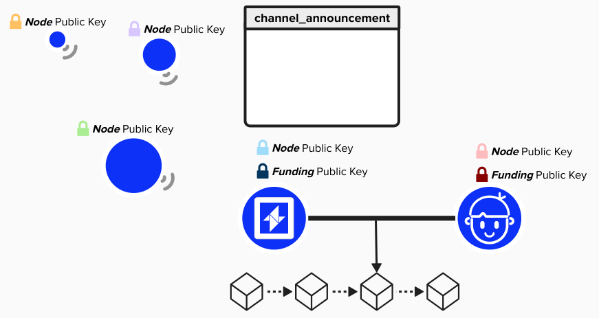
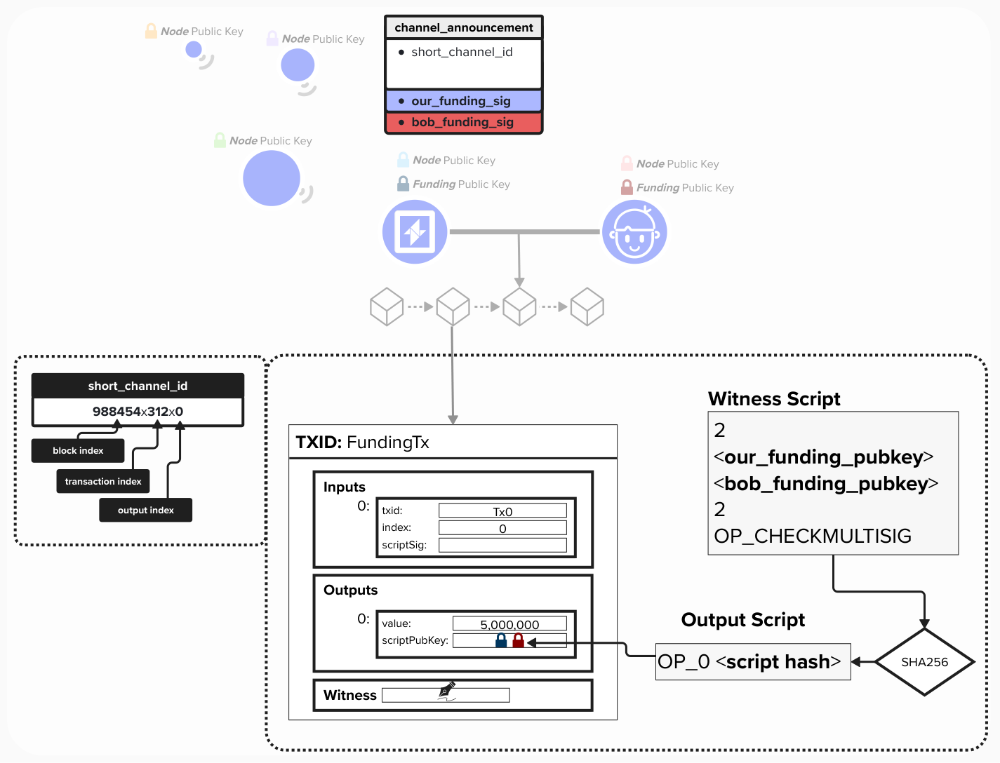

# Gossip Protocol (BOLT# 7)

The **Gossip Protocol** defines the language that nodes must speak to inform eachother of both node and channel updates.
- **Node Updates**: When a new channel is available, the channel partners must inform other nodes on the Lightning network of how they can connect to this channel. Specifically, that mean each channel party will inform the network of their node ID, host, and port.
- **Channel Updates**: The beauty of the Lightning network is that it enables routing payments at near-instant speeds with near-zero fees. However, to identify the optimal route from point A to B, nodes must know the network topology, along with required data for routing such as channel fees and CLTV expiry deltas.

## Channel Announcement
Whenever two peers open a new **public** channel, each node must announce their channel to the network using a `channel_announcement` message. The **primary purpose** of the `channel_announcement` message is to prove to the network that this channel is legit. 

Imagine Alice and Bob are announcing a channel. To prove the valid existence of their channel, they must:

1) Prove that their funding transaction is locked to **alice_pubkey** and **bob_pubkey**
2) Prove that **Alice's Lightning Node**, which has it's own **Node ID** owns the **private key** to **alice_pubkey**.
3) Prove that **Bob's Lightning Node**, which has it's own **Node ID** owns the **private key** to **bob_pubkey**.

  

#### Question: What information needs to be provided in the `channel_announcement` message to prove the legitimacy of this channel?

  
Answer

First, to prove the existance of the funding transaction, Alice and Bob must provide a `short_channel_id` that points to the location on the Bitcoin blockchain where the funding transaction resides. This means pointing to the **block index**, **transaction index**, and **output index**.

Second, they must each provide the **public keys** used in the funding transaction so that a third-party can reconstruct the **witness script** and verify it's locked to those public keys.

Finally, they must provide signatures for the `channel_announcement` message, using *both* their on-chain **funding private key** and off-chain **Lightning Node ID private key**. By providing these signatures, they prove that they control both the on-chain UTXO and off-chain Lightning channel, so they can effectively route HTLCs.

  

## Announcement Signatures
You may have been wondering *how* both parties exchange signatures for the `channel_announcement` message. If so, great question!

Technically, before sendning a `channel_announcement` message, both nodes would exchange an `announcement_signatures` message. To do this, they will create the `channel_announcement` ***locally*** so that they can generate the appropriate signatures. Then, they will send the signatures to each other.

  

## Node Announcement
Now that we've informed the network of our channel, we can send a `node_announcement` message. This message serves two primary purposes:
1) Communicate connection information so that other node's can connect to our node to either bootstrap the network graph or open a channel with us.
2) Communicate which features our node supports (ex: anchor outputs, multi-part payments, dual-funding)

  

#### Question: In BOLT 7 of the Lightning protocol, it says "if `node_id` is NOT previously known from a `channel_announcement` message, the receiving node SHOULD ignore the `node_announcement` message. Why do you think this is? Does this protect us against a potential attack vector?

  
Answer

The `channel_announcement` message proves that a given node actually has funds locked in a UTXO on-chain. By only accepting and processing `node_announcement` from nodes that have locked up funds on-chain, we are effectively leveraging on-chain as an anti-spam mechanism. In other words, to join the Lightning network, you have to prove that you've locked up funds on chain.

This helps prevent denial-of-service attacks from node's that, otherwise, would floor the network with fake `node_announcement` messages.

## Channel Update
Finally, to complete our entry into the Lightning network and ensure that others can successfully route payments through us, both our node and Bob's node will have to broadcast a `channel_update` message.

The `channel_update` message is crucial to routing HTLCs, as it provides vital information that other node's will need to optimally route payments across the network. As you can see below, the `channel_update` message informs other nodes of our feerate policy and `cltv_expiry` requirements for routing HTLCs through this channel with Bob.

  

#### Question: Imagine we're routing an HTLC from node A to node D. We have the following six `channel_update` messages from each node for the route. Which `channel_update` messages have relevant information for our routing?

  

  
Answer

Since we're routing from A to D, this means that node's B and C will be forwarding sats for us and requesting a fee in return. Therefore, we will have to reference the following messages when setting up our HTLC outputs:
- Channel Update (B->C)
- Channel Update (C->D)

