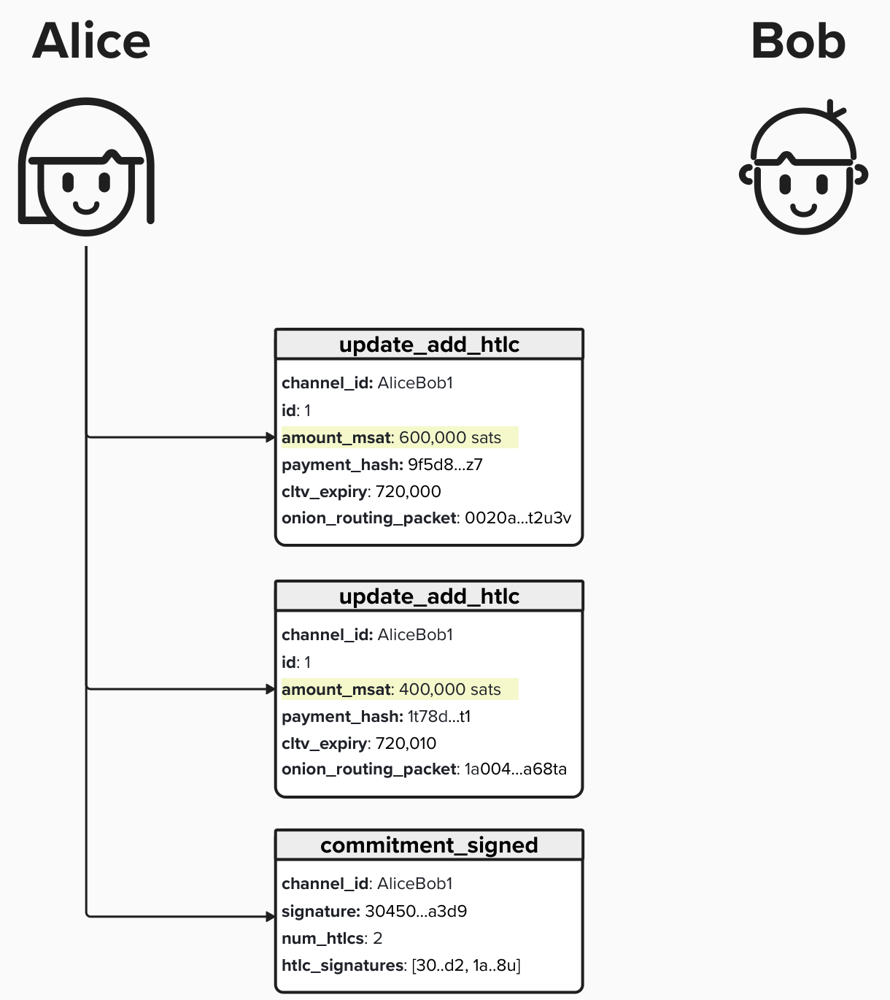

# Connect to Peers

To conenct to peers, we're going to need to implement the ability to conduct high performance I/O operations. For those of you who do not come from a computer networking background, let's take a moment to unpack "high performance I/O operations", as it's helpful to understanding both how Lightning nodes and LDK work under the hood.

<p align="center" style="width: 50%; max-width: 300px;">
  
</p>

First, let's discuss an **Input/Output** (**I/O**) operation. In the context of our Lightning node, an I/O operation refers to the process of exchanging data between our program and external systems (other nodes or servers on the network). This is how we'll be able to communicate vital tasks for our node, such as gathering network gossip, opening channels, and routing payments. 

Now, we don't want our operations (there will be many!) to be slow or get in the way of eachother. In other words, we're going to want "high performance" operations. This means that our operations should have properties like being asynchronous and non-blocking. An asynchronous operation will initiate the task and then immediately continue to executing other tasks. On the other hand, synchronous operations will wait until the current task has finised until moving on to the next one. In other words, it will "block" other tasks from completing while it's waiting.

#### Question: Why is it imperative that our node performs asyncronous I/O instead of synchronous? This may seem like a trivial question, but it's worth pondering if you don't come from a system background!


<details>
  <summary>Answer</summary>

This isn't a trick question! It's just meant to spark further thought.

In short, our Lightning node will be performing many actions at once. For example, we'll be processing new gossip messages, opening channels, routing payments, monitoring the blockchain, etc. The list goes on and on.

If we had to wait for any given task to complete before moving on to another task, we wouldn't be able to run an working node.

</details>

## TCP (Transmission Control Protocol)

To connect to our peers, we'll rely on a TCP/IP connection. This includes protocols such as IPv4, IPv6, and Tor. These protocols are used because they satisfy properties that Lightning requires. For example, consider this sentence from [BOLT #1](https://github.com/lightning/bolts/blob/master/01-messaging.md), which describes Lightning's Base Protocol: **This protocol assumes an underlying authenticated and ordered transport mechanism that takes care of framing individual messages**.

#### Question: Why is ordered transport required by Lightning?


<details>
  <summary>Answer</summary>

First, let's review what "ordered transport" is.

**Ordered transport**, unsurprisingly, means that messages will arrive in the same order that they were sent. To see why this is critical, let's take a brief detour to [BOLT #2: Peer Protocol for Channel Management
](https://github.com/lightning/bolts/blob/master/02-peer-protocol.md). BOLT #2 describes the message types that peers will send eachother to update their channel states. For instance, consider the following common message types:

<p align="center" style="width: 50%; max-width: 300px;">
  
</p>

- `update_add_htlc`: Node A will send this message to node B (or vice versa) to indicate that they would like to add an HTLC to their commitment transactions.
- `commitment_signed`: Node A will send this message to node B (or vice versa) to provide the signature(s) for the current commitment transaction, effectively advancing channel state.

Let's imagine that Alice wants to add two HTLCs to her channel with Bob. She can do that by sending two `update_add_htlc` messages to Bob and then sending a `commitment_signed` message with the appropriate signatures.

<p align="center" style="width: 50%; max-width: 300px;">
  
</p>

Notice that the `commitment_signed` does not explitly mention which HTLCs the signatures are for. Instead, it does this implicitly. Since Lightning messages are assumed to be ordered and reliable, the protocol assumes that messages sent will always arrive, and they will arrive in the order they are sent. This way, Alice can rest assured that, if Bob gets the `commitment_signed`, he also got the `update_add_htlc` messages in the correct order.

For a great in-depth blog, discussing how to operate a Lightning channel, please see [Normal operation and closure of a pre-taproot LN channel](https://ellemouton.com/posts/normal-operation-pre-taproot/) by Elle Mouton.

</details>

TCP achieves reliable message delivery by assigning a *sequence number* to each byte of data transmitted to the receiver. To ensure that the data was successfully received, TCP requires the reciever to send a positive acknowledgment (ACK) back to the sender. If the ACK message is not received before the time-out interval, the data will be sent again.

Additionally, since the data is transmitted with sequence numbers, the receiver can correctly order the data they reciever, ensuring that it is processed and handled in the right order. Cool stuff, eh!

## Connecting to Peers

To connect to peers, we'll need to identify them by their **TCP Address**. A TCP address is composed of an **IP Address** and a **Port Number** in the following format: `IP:Port`.

An **IP Address** is used to identify a specific host on a network and functions like a postal address, allowing data to be delivered to the correct location. There are two types of IP Addresses:
- **IPv4**: A 32-bit address
- **IPv6**: A 128-bit address

A **Port Number** identifies the specifi capplication running on the device. It can be a 16-bit integer, effectively between 0-65,535. Lightning's default port is 9735.

Nodes that wish to prioritize privacy and anonymity, may opt to run or leverage a **Tor (The Onion Router)** server, thus concealing their IP Address. The Tor client will then route any incoming or outgoing connections through the Tor network's encrypted relays, thus preserving your privacy. Users who leverage Tor will have an **onion address**, which reads `<username>.onion:<port>`.

## LDK lightning_net_tokio Crate

LDK provides a `lightning_net_tokio` Rust crate which provides a socket handling library for who wish to use rust-lightning with native a `TcpStream`.

LDK has made implementing this create quite easy, with just a few steps to complete.

## ⚡️ Define our TCP Listener

To enable our node to interact with the Lightning Network, we'll need to inform LDK of where our node should be listening for incoming network traffic. We can do this by defining a `TcpListener` and then passing our listener and a `PeerManager` as inputs to the `setup_inbound` function, which is made available via `lightning_net_tokio`.

For this exercise, we'll complete a simplified version of this process. Head over to `src/ch2_setup/`network_exercise.rs`. In this file, you'll see the function `start_listener`, which takes a **port** and `PeerManager` as an input. To complete this exercise, we'll have to define a TCP listener and then set up a loop to continously listen for new peers, and then pass them into the helper function `setup_inbound` .

```rust
pub async fn start_listener(peer_manager: PeerManager) {
    // define port 9735
    
    // define TcpListener

    // loop
        // accept incoming connection

        // pass to setup_inbound
    }
}
```

Below, you will find some helpful information to assist in completing each step.

<details>
  <summary>1. Define our TCP Listener</summary>
  
First we create a listener socket, which is bound to the IP address that we provide.  To do this, we'll use the `TcpListener::bind` method provided by the `tokio` [crate](https://docs.rs/tokio/latest/tokio/net/struct.TcpListener.html#method.bind). 

Note that the `bind()` method is an asychronous function that returns a `Result<TcpListener>`. All [`Result`](https://doc.rust-lang.org/std/result/) types are **enum** where the value is either `Ok()` or `Err()`. Therefore, the `bind()` method will either return an `Ok(TcpListener)` or `Err()`. 

In the below example, we are creating a listener that binds to local host port 2345. As mentiond above, since the `bind()` method returns a `Result<TcpListener>`, we'll have to process the result as follows:
1) We must call `.await` because `bind()` is an asychonous call, so we must wait for the result to be resolved.
2) When `await` is resolved, we will have a `Result` type. `expect()` is a method available for `Result` types to unrwap the result and either return the expected type or panic and return an error with the specified message.

```rust
let listener = TcpListener::bind("127.0.0.1:2345")
    .await
    .expect("Insert failure message here");
```

</details>


<details>
  <summary> 2. Listen for Connection</summary>

To keep our TCP listener active and continuously accept incoming connections from peers, we need to create an loop. This loop will run indefinitely, checking for and handling new connections as they arrive.

### Creating a Loop in Rust
To create a loop in rust, you can use the following notation:

```rust
loop {
 // insert loop logic here 
}
```

### Accept New Connections
Whenever a new peer tries to connect to use we can accept the connection by calling [`listener.accept()`](https://docs.rs/tokio/latest/tokio/net/struct.TcpListener.html#method.accept). Similar to the `bind()` method, `accept() is asynchronous and will return a **Result** of type `Result<(TcpStream, SocketAddr)>`, so we need to leverage `.await` and `.expect` accordingly.

```rust
let (tcp_stream, addr) = listener.accept()
    .await
    .expect("Failed to accept connection");
```

</details>

<details>
  <summary> 3. Setup Inbound LDK Connection </summary>

Finally, once we have the TCP stream, we can pass it to the [`setup_inbound`](https://docs.rs/lightning-net-tokio/latest/lightning_net_tokio/fn.setup_inbound.html) function provided by the `lightning-net-tokio` crate. This will initialize the new connection within the framework of LDK.

Normally, you would use the `setup_inbound` mentioned above, however, for simplicity, a mock function is available to use. When using this function, note the following:
- In Rust, a value can only have one owner at a time. When we pass `peer_manager` into `setup_inbound`, the function will need to take ownership of the Peer Manager. For this reason, we must call `.clone()`, thus creating a copy of the Peer Manager to pass into the function.
- Similar to the above, we call `.await` for this asynchronous process.

```rust
setup_inbound(peer_manager.clone(), tcp_stream).await;
```

</details>


## ⚡️ Connect to Our Node & Open A Channel

Great, we've built a way for other nodes to connect to us! To build our intuition of how this process works, let's get some hands on protocol experience with opening a Lightning channel! 

<details>
  <summary>1. Start Peer Listener</summary>
To begin this exercise, go to your **Shell** and type the bellow command:

```
cargo run -- peer-listen
```

This command will start up a program that creates a simulated PeerManager, listening on port 9375. If this program starts correctly, you should see the below message:

```
🚀 Listening for peer messages on port 9735
```

When the program starts, you may see a few "Webview" tabs open. It's safe to close these.

<p align="left" style="width: 50%; max-width: 300px;">
  
</p>

</details>

<details>
<summary>2. Connect to Our Node</summary>

Let's pretend to be another node on the Lightning network! To do this, let's open up a new **Shell** and enter the command below. This will allow us to connect to the `TcpListener` that we created in the previous exercise.

```
nc -v 127.0.0.1 9735
```

Once connected, you should see the below message. This means you've succesfully created a TCP connection to our Lightning node from the shell.

```
Connection to 127.0.0.1 9735 port [tcp/*] succeeded!
```

If you look at the **Shell** you used to start the listener, you should see the below notification:

```
✅ New peer connected from 127.0.0.1
```
</details>

<details>
<summary>3. Send OPEN_CHANNEL Message</summary>
  
Now that we're connected, our LDK node will just have set up a `PeerManager` for our connection. Let's simulate **opening a channel** with our node by interacting with the `PeerManager` from the command line. All of the messages in this exercise will mirror the actual flow that is described in [BOLT #2: Peer Protocol for Channel Management](https://github.com/lightning/bolts/blob/master/02-peer-protocol.md),

We'll start by sending an `OPEN_CHANNEL` message. You must provide the following arguments:
- `funding_amt`: This is the amount (in sats) that you would like to fund the channel with.
- `to_self_delay`: This is the minumum OP_CSV delay that you require your counterparty to timelock their `to_local` outputs with.
- `sats_p_vbyte`: This is the proposed fees for the commitment transaction (in sats per vByte). In the actual protocol, you send a fee rate in sats per 1000-weight, but we're using sats sats/vByte because that's what most block explorers use.

```
OPEN_CHANNEL <funding_amt> <to_self_delay> <sats_p_vbyte>
```

Here is an example of how you can open a channel with the following characteristics:
- 10,000 Channel Capacity
- 100 blocks to-self-delay
- 6 sats/vByte fee
```
OPEN_CHANNEL 10000 100 6
```

#### Try opening a channel!

<details>
  <summary>Hint</summary>

Ahh, if you've clicked this drop-down, chances are your first channel was rejected. In the Lightning network, channel partners negotiate specific properties of their channel. For this exercise, the LDK node we're connecting to will only accept channels that satisfy the following:
- Funding amount must be >= 100,000
- Sats/vByte fees must be >= 10 sats/vByte
- To-Self-Delay must be <= 144

In other words, our LDK node will not accept channels for less than 100,000 sats and wants to ensure that commitment transactions have reasonable fees so that they can be published at some arbitrary point in the future. Additionally, the node does not want to wait an unreasonable amount of time to collect its `to_self` outputs, so the CSV delay cannot be greater than 144.

</details>

Once your `OPEN_CHANNEL` message is accepted, you should see below following message sent back in your **Shell**. In this message, the LDK node is providing a temporary channel ID, the `to_self_delay` that we are expected to use, and the channel keys that we will use to create the required public and private keys for the life of this channel.

```
ACCEPT_CHANNEL: temp_channel_id=100 to_self_delay=144, channel_keys[...]
```

#### Question: Why is this a temporary channel id?
<details>
  <summary>Answer</summary>

The "real" channel id, which is the channel id that is used to refer to a channel once it's active, is derived from the **funding transaction id** and the **funding output index**. At this point in the process, we have not created the funding transaction yet, so we have to use a temporary channel id.

</details>

</details>

<details>
<summary>4. Send FUNDING_CREATED Message</summary>
Once you recieve the `ACCEPT_CHANNEL` message from the LDK node, take note of the `temp_channel_id`.

Since we're opening the channel, we will now create the funding transaction on our side and send it to the LDK node. To do this, we will have to send them the following:
-  Funding transaction id
-  Funding transaction output index
-  Signature for first commitment transaction

Below is an example of the command you will type in the **Shell**.
```
FUNDING_CREATED <temp_channel_id> <funding_tx_id:output_index> <signatures>
```

For the purposes of this exercise, `funding_tx_id` and `signature` can be any sequence (of any length) of characters. Also, the `output_index` must be provided after the `funding_tx_id`, separated by a colon (`:`). Below is an example:

```
FUNDING_CREATED 105 as4f79df:0 asfaf14g112
```

Once your `FUNDING_CREATED` message is accepted, you should see the below message sent back in your **Shell**. In this message, the LDK node is providing a channel ID, derivied from the funding transaction, and a signature that we can use on our first commitment transaction.

```
FUNDING_SIGNED: channel_id=elq, signature=[avb1adx4]
```

</details>

<details>
<summary>5. Send CHANNEL_READY Message</summary>

At this point, we now have a signature for the first commitment transaction, which is also our "refund" transaction, so we would take the funding transaction and broadcast it to the network!

After doing that, we would send the LDK node a `CHANNEL_READY` transaction, specifying the `channel_id` of the channel.

```
CHANNEL_READY <channel_id>
```

#### Go ahead and give it a try!

Once sent, the LDK node should sent a `CHANNEL_READY` message back to us!

</details>