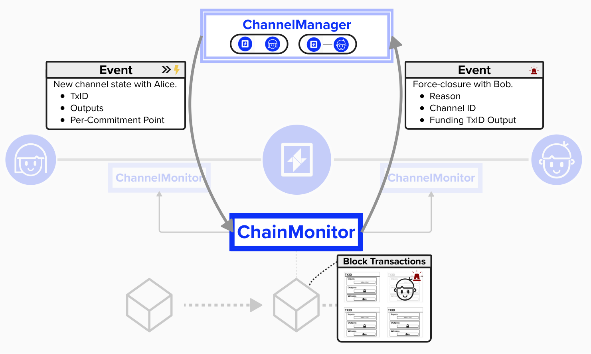

# Implementing Lightning Functionality

Wow! While it may feel like we've implemented a lot so far (we have!), we've really only scratched the surface. As of now, our Lightning node can accomplish tasks such as:
- Fetch new blocks
- Broadcast transactions
- Estimate transaction fees
- Manage our on-chain and off-chain wallet
- Persist data
- Interact with peers via Lightning's communication protocols

However, we're still missing major pieces of the puzzle! We need to equip our node with the ability to perform the operations of a Lightning, including:
- Managing channel lifecycles (opening, closing, updating)
- Processing payments (sending, receiving, forwarding)
- Maintaining and advancing channel commitment transactions
- Responding to on-chain events that affect our channels

As of now, our node is just a **SKELETON NODE**, and not in some cool cypherpunk way.
<p align="center" style="width: 50%; max-width: 300px;">
  
</p>

## ChannelMonitor and ChainMonitor

To begin our Lightning network functionality, we're going to introduce two very important components that we will need to build:the `ChannelMonitor` and `ChainMonitor`.

### Channel Monitor

The **Channel Monitor** will be in charge of tracking the state of each payment channel we open. This means this object will need to hold information such as the 2-of-2 funding output, both our keys and our counterparty's keys (including their per-commitment secrets, which are used for revocation keys), payment preimages, and much more. Each Lightning channel will have its own `ChannelMonitor`. It's hard to overstate the importance of this structure!

### Chain Monitor

The **Chain Monitor** will be in charge of monitoring on-chain activity. Whenever a new block is mined, it will hand it over to each **Channel Monitor** so that the **Channel Monitor** can determine if it needs to react to on-chain activity. For example, if an old commitment is published by our counterparty, the **Channel Monitor** will have all the information it needs to immediately broadcast a punishment transaction.

Additionally, the **Chain Monitor** will be in charge of persisting the **Channel Monitor** each time there is a state change. This is absolutely crucial, as we will need to ensure that each state is successfully persisted before we can move to our next channel state.

Together, the **Chain Monitor**  and **Channel Monitor** connect ***off-chain*** **channel management** with ***on-chain*** **transaction monitoring**

<p align="center" style="width: 50%; max-width: 300px;">
  
</p>


### Build a Channel Monitor

To equip our node with the ability to represent Lightning channels internally, let's start building our Channel Monitor. To do this, we'll create the following structure in Rust.

```rust
pub struct ChannelMonitor {
  channel_id: ChannelId,
  funding_outpoint: OutPoint,
  channel_value_sats: u64,
  current_commitment_tx: Option<Transaction>,
  best_block: BestBlock,
  commitment_secrets: Vec<[u8; 32]>,
  preimages: Vec<Preimage>,
  outputs_to_watch: HashMap<Txid, Vec<(u32, ScriptBuf)>>,
}
```

As you can see, this structure contains important information for our Lightning channel, such as the Channel ID, funding outpoint (location of 2-of-2 multisig funding output), channel value, current commitment transaction, as well as commitment secrets and preimages that we may have used in the past. Also, note that we have an `outputs_to_watch` HashMap (dictionary), which stores the `Txid`, output index, and output scripts for any outputs that we need to monitor for in new blocks. For example, the 2-of-2 funding output and any outputs from current or prior commitment transactions that we have ownership claims to will be included here. By keeping these outputs handy, it's much easier to check new blocks and transactions to see if they contain any outputs of interest.

#### ⚡️ Implement `block_connected` for `ChannelMonitor`

As mentioned above, the `ChannelMonitor` will be informed by the `ChainMonitor` whenever there is on-chain activity (such as finding a new block), so we will need to equip our `ChannelMonitor` with the ability to take this new block, search through its transactions, and check if spends any outputs that we are monitoring for.

If we identify any transactions of interest, we need to act accordingly! For example, if our counterparty publishes an old commitment state, we need to publish a penalty transaction (using the revocation key!), and then we need to update our `ChannelMonitor`'s `outputs_to_watch` with the new outputs from our penalty transaction so that we can empower our `ChannelMonitor` to monitor the new outputs, ensuring they are confirmed in a new block.

To do this, we can will define a new method, `block_connected`, which takes block header, block height, and transaction data. It will also take a broadcaster, which we can use to publish any transactions that may be created as part of this process.

To complete this exercise, you will need to do the following:
1) Loop over each transaction in the `txdata`
2) Check if the transaction spends an output that the `ChannelMonitor is watching for`
3) Create penalty transaction
4) Broadcast any penalty transactions
5) Add any new outputs to `outputs_to_watch`

```rust
impl ChannelMonitor{
pub fn block_connected(
  &mut self,
  header: Header,
  txdata: TransactionData,
  height: u32,
  broadcaster: BitcoindClient
) {

  // Step 1: for each transaction in data
  
    // Step 2: check if it spends an output that the ChannelMonitor is watching for
      
      // Step 3: if yes, react by creating a new transaction

      // Step 4: broadcast the new transaction

      // Step 5: add the new outputs to our `outputs_to_watch`
  }

}
```
#### Click below for helpful hints

<details>
  <summary>Step 1: Looping in Rust</summary>

To loop over a vector in Rust, you can use the following notation:

```rust
for element in vector {
  // do something
}
```

</details>

<details>
  <summary>Step 2: Checking if a transaction spends from our outputs_to_watch</summary>

The below helper function is provided to complete this step. 

```rust
fn spends_watched_output(&self, tx: Transaction) -> bool {
  for input in tx.input {
    if let Some(outputs) = self.outputs_to_watch.get(&input.previous_output.txid) {
      for (output_idx, script_pubkey) in outputs.iter() {
        if output_idx == &input.previous_output.vout {
          return true;
        }
      }
    }
  }
  false
}
```

Notice that it returns a `bool`, so you can leverage it by using the below notation:

```rust
if self.spends_watched_output() {
  // if true, do something
}
```

</details>


### Build a Chain Monitor

Now that we have the ability to represent a Lightning channel state machine and react to on-chain activity, let's organize and coordinate this process by using a `ChainMonitor`. The `ChainMonitor` will enable us to optimize the monitoring of the Bitcoin blockchain by having one coordinator be responsible for that task, distributing new blocks to `ChannelMonitors` as they are found.

Let's create the `ChainMonitor` in rust. As you can see, the `ChainMonitor` will contain a HashMap of each `ChannelMonitor`, where the key is the funding outpoint for the given `ChannelMonitor`. It will contain an object that implements the `BroadcasterInterface` and `KVStore`, the latter is used for persistance. These should be familiar, since we created them earlier in the workshop!

```rust
pub struct ChainMonitor {
  monitors: HashMap<OutPoint, ChannelMonitor>,
  persister: FileStore,
  broadcaster: BitcoindClient
}
```

### ⚡️ Implement `transactions_confirmed` for `ChainMonitor`

There are a few important pieces of functionality that we will need to implement for the `ChainMonitor`. Let's start with notifiying each `ChannelMonitor` of new blocks. To do this, we'll complete `transactions_confirmed`. This function will take the new block data and pass it to each `ChannelMonitor`, thus allowing our node to have one central location where it can recieve block data to propogate internally.

To complete this exercise, you will need to:
1) Loop over each monitor in our hashmap (`monitors: HashMap<OutPoint, ChannelMonitor>`)
2) Call the `block_connected` function we just implemented in the last exercise

```rust
impl ChainMonitor {
  fn transactions_confirmed(&mut self,
    header: Header,
    txdata: &TransactionData,
    height: u32,
    broadcaster: &BitcoindClient
  ) {
    // loop over each monitor in `monitors`
      // call monitor.block_connected
    }
  }
}
```
#### Click below for helpful hints

<details> 
  <summary>Step 1: Looping over `monitors`</summary>
  
In Rust, how we loop over a collection depends on whether we need to own, borrow, or modify its contents. In our earlier `ChannelMonitor` example, we looped over `txdata` (a `Vec<Transaction>`) like this:

```rust
for tx in txdata {
  
}
```
  
There, we took ownership of the `Vec`, cloned each `Transaction` as needed, and let it be dropped when the function ended. It was a one-time use of the data.

Now, in `ChainMonitor`, we’re looping over `self.monitors`, a `HashMap<OutPoint, ChannelMonitor>`. Unlike a `Vec`, a `HashMap` stores key-value pairs, and we need to modify the `ChannelMonitor` values by calling `.block_connected()` on them. This method requires a mutable reference `(&mut ChannelMonitor)` because it updates the monitor’s internal state. To get mutable references to the values in the `HashMap`, we use `.iter_mut()` like this:

```rust
for (_, monitor) in self.monitors.iter_mut() {
    // Do something with monitor
}
```

#### Here’s what’s happening:

`.iter_mut()` gives us an iterator over `(&OutPoint, &mut ChannelMonitor)` pairs—immutable references to the keys and mutable references to the values.

We use `(_, monitor)` to destructure each pair. The `_` ignores the `OutPoint` key (since we don’t need it here), and `monitor` is our `&mut ChannelMonitor`.

</details>

<details> 
  <summary>Step 2: Call `.block_connected()`</summary>

Once we've obtained a mutable copy of the `ChannelMonitor` and are within the loop, we just need to pass the appropriate data within the .block_connected() function that we created previously.


</details>


### ⚡️ Implement `watch_channel` for `ChainMonitor`

You might be wondering: how do we add a new `ChannelMonitor` to the `ChainMonitor`? To do that, we’ll implement an internal method called `watch_channel`. We’ll see how this gets called later, but for now, let’s focus on completing it. This function takes a `funding_outpoint` (the key for our `HashMap`) and a `ChannelMonitor` as inputs. It should:

1) Add the monitor to our internal `HashMap` (`self.monitors`) to track it.
2) Persist the monitor to disk using the `persister`.

Persistence is incredibly important in a Lightning node. If we fail to save the channel state, we can’t safely move to the next state or continue operations — otherwise, we risk losing funds! So, `watch_channel` will return a `Result` containing a `ChannelMonitorUpdateStatus` (`Completed` or `UnrecoverableError`) to let the caller know if persistence succeeded. This way, we can propagate any errors up and handle them appropriately.

<details>
  <summary>Click to see the `ChannelMonitorUpdateStatus`</summary>

```rust
pub enum ChannelMonitorUpdateStatus {
  Completed,
  UnrecoverableError
}
```
</details>


```rust
impl ChainMonitor {
fn watch_channel(&mut self, funding_outpoint: OutPoint, channel_monitor: ChannelMonitor) -> Result<ChannelMonitorUpdateStatus, ()> {
  
  // insert channel into our `monitors` field

  // attempt to persist monitors to disk

  // if success --

  // if failure ---

  }
}
```


### ⚡️ Implement `update_monitor` for `ChannelMonitor`

Finally, we need to make sure we can update each channel when our channel state advances (ex: add a new HTLC, receiving a preimage, obtaining a new commitment secret, etc.). In reality, there is much more that we will need to store in our `ChannelMonitor` than what we have, but this gives us a good idea.

For this exercise, we will complete `update_monitor`, which will update the monitor's internal state with whatever the associated update is. For this exercise, our function will have to accomodate each possible update in the `ChannelMonitorUpdate` struct below:

1) **PaymentPreimage**: We recieve a preimage for an HTLC that the given channel is routing. If this occurs, we need to store the preimage within the vector of preimages that we have in our `ChannelMonitor`.
2) **CommitmentSecret**: Whenever we advance to a new channel state, our counterparty will give us the commitment secret *for the previous state*, which allows us to calculate the private key to the revocation public key that they put in *their* previous commitment transaction. In other words, we can now punish them if they cheat! Similar to the preimages, we will need to store this within the vector of commitment secrets in our `Channel Monitor`

```rust
enum ChannelMonitorUpdate {
  PaymentPreimage {
    payment_preimage: Preimage
  },
  CommitmentSecret {
    secret: [u8; 32]
  }
}
```

```rust
impl ChannelMonitor {
  pub fn update_monitor(&mut self, update: ChannelMonitorUpdate) {
    match update {
      ChannelMonitorUpdate::PaymentPreimage {payment_preimage}  => {
      self.preimages.push(payment_preimage);
      },
      ChannelMonitorUpdate::CommitmentSecret {secret} => {
      self.commitment_secrets.push(secret);
      },
    }
  }
```

### ⚡️ Implement `update_channel` for `ChainMonitor`

Remember how we said that channel states should not advance unless they are properly persisted? Well, since the `ChainMonitor` is responsible for persisting channels, we will add a new function, `update_channel` to our `ChainMonitor` which will enable it to both update and persist a `ChannelMonitor` at the same time.

```rust
impl ChainMonitor {
  fn update_channel(&mut self, funding_outpoint: OutPoint, update: ChannelMonitorUpdate) {
    let channel_monitor = self.monitors.get_mut(&funding_outpoint).unwrap();
    channel_monitor.update_monitor(update);
    self.persister.persist_channel(funding_outpoint, channel_monitor.clone());
  }
}
```

## ChannelManager

Now that we've implememnted the `ChainMonitor`, which equipt our node with the ability to monitor **on-chain** activity, let's focus on off-chain activity. To do this, we'll need to implement the `ChannelManager`, which is our lightning node's channel state machine, handling **off-chain** tasks such as sending, forwarding, and receiving payments.

Before proceeding, it's helpful to discuss the relationship between the `ChannelManager`, `ChainMonitor`, and `ChannelMonitor` a little further. Since the `ChannelManager` focuses on off-chain activity, it's responsible for tasks such as exchanging messages with peers, opening, closing, and updating channels. When opening a new channel, it will generate a `ChannelMonitor` and when updating a channel, it will generate a `ChannelMonitorUpdate` for each change. It will then notify the `ChainMonitor` of these updates. Once the `ChainMonitor` is aware of the `ChannelMonitor`, it will begin monitoring the on-chain blockchain for relevant activity. If any on-chain activity is detected - for example, broadcasting a punishment transction if a counterparty attempts to cheat, then the `ChainMonitor` will notify the `ChannelManager` that this action has taken place, and the `ChannelManager` will act accordingly and close the channel off-chain. 

The division of on-chain and off-chain activity allows for more advanced and interesting node setups. For example, you could deploy a redundant copy of the `ChainMonitor` on a different server, providing a robust backup so that you can continue to monitor the blockchain and act accoringly, even if your primary node crashes or restarts. Alternatively, if your primary node is resource constrained, you can deploy the `ChainMonitor` on a separate server to provide higher uptime and reliability. This setup is similar to a "watchtower" setup, where you outsource 24/7 blockchain monitoring to ensure you catch any suspicious on-chain activity immediately.

<p align="center" style="width: 50%; max-width: 300px;">
  
</p>

### ⚡️ Implement `create_channel` for `ChainMonitor`

For this exercise, we'll implement `create_channel` for our `ChannelManager`. Below, you can see a very simple implementation of a ChannelManager. The important piece to notice is that our `ChannelManager` will hold a reference to a `ChainMonitor` within it.

```rust
pub struct ChannelManager {
  pub chain_monitor: ChainMonitor,
  pub pending_peer_events: Vec<MessageSendEvent>,
  pub pending_user_events: Vec<Event>,
  pub peers: HashMap<PublicKey, Channel>,
  pub signer_provider: SimpleKeysManager,
}
```

Try to implement `create_channel`. This function will take a `PublicKey` for a peer and a channel value, which will be the amount we'd like to lock up in the payment channel.

```rust
impl ChannelManager {
  pub fn create_channel(&mut self, their_network_key: PublicKey, channel_value_satoshis: u64) {

    let mut channel = OutboundV1Channel::new(their_network_key, channel_value_satoshis);

    let result = channel.open_channel();

    match result {

      ChannelOpenStatus::Success {funding_outpoint, channel_monitor} => {

        if let Err(_) = self.chain_monitor.watch_channel(funding_outpoint, channel_monitor) {
          panic!("Failed to watch channel")
        }

      },
      ChannelOpenStatus::Failure => {

        panic!("Open Channel Failed")
      }
    }
  }
}
```

