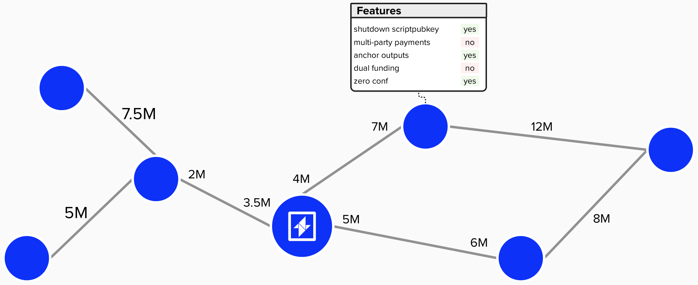

# Network Management

As we saw earlier, the Lightning Network is a collection of payment channels. By linking payments channels together, we can form a chain of payment channels and route Bitcoin payments across the network.

LDK provides various components that we can take advantage of to accomplish tasks such as:
- Storing the network graph without our node
- Optimizing payment routing
- Retrieving P2P gossip to build out our network graph 


<p align="center" style="width: 50%; max-width: 300px;">
  
</p>

## Network Graph

LDK provides a `NetworkGraph` structure to store data network related data such as known channels and their supported features.

<p align="center" style="width: 50%; max-width: 300px;">
  
</p>

#### Question: We know the channel balances for any channels that we're connected to, but how do we know the capacity for other public channels in the Lightning Network?

<details>
  <summary>Answer</summary>

There are a few pieces of information that can be helpful when estimating the capacity of Lightning Network channels that we're not connected to.

To create an upper-bound on our estimate, we can verify the funding UTXO that is communicated as part of a `channel_anouncement` message. While this doesn't tell us how the sats are distributed within a channel, it does tell us what the estimated total balance is for the channel.

Another place we can look to for insights on a channel's capacity is the `channel_update` message. When channel is announced (or updates are made), each node in the channel will send a `channel_update` message with information regarding its routing fee structure and the minimum/maximum htlc that the node will send through the given channel.

</details>


### Initializing The Network Graph

To instantiate a new network graph, LDK provides a `new` method on the `NetworkGraph` structure. All you need to do is provide the `Network` (Mainnet, Testnet, Regtest) and a structure that implements LDK's [`Logger` trait](https://docs.rs/lightning/latest/lightning/util/logger/trait.Logger.html).

```rust
let network_graph = NetworkGraph::new(network, logger)
```

## Routing

While each node has its own internal representation of the Lightning Network graph, the information within this graph is incomplete to optimally route payments. This is largely because, when nodes announce new (or updated) channels to the network, they do not specify how the capacity is distributed between the two channel parties, making it difficult to know for certain if a given channel is a viable option when routing payments. 

This presents two fundamental challenges when routing payments on the Lightning Network:

1) Missing Information: Nodes may not know if a given channel's liquidity is prohibitively unbalanced.
2) Path-Finding Optimization: If multiple payment paths exist, we must decide which path is the best.


<p align="center" style="width: 50%; max-width: 300px;">
  
</p>

#### Question: Of the above three paths (top, middle, bottom) from you to Alice, which path is optimal if you want to route 4M sats to Alice? You an assume each node has the same routing fees.

<details>
  <summary>Answer</summary>

If we assume that each path has the same routing fees, then the bottom path is the best. This is because it only has three nodes in the payment route, while the top path has four. Since we're assuming each node has the same fee stucture, then then this will be the cheapest. The middle path would not work because we only have 3M sats on our side of the channel, so we cannot route 4M sats through this path.

</details>

To help address both of the above challenges, LDK provides a `ProbabilisticScorer`. This component holds information about our node's current view of the Lightning Network graph, including estimates of available liquidity within each channel. It also records historical liquidity observations, which are updated each time our node either fails or succeeds at making a payment (or probe).

Ultimately, a `ProbabilisticScorer` is used to identify the optimal path for routing a payment by scoring each channel in a candidate path. With this information, the `ProbabilisticScorer` helps identify routes with a high probability of success while minimizing transaction fees.

### Initializing The `ProbabalisticScorer`

To create a new `ProbabalisticScorer`, you wil first need to define `ProbabilisticScoringDecayParameters`. These parameters configure how each channel’s available liquidity estimates are updated over time.

Given that the Lightning Network graph is constantly changing as payments flow throughout the ecosystem, our LDK node must account for the passage of time and assume that channel balances will change even if our node has not probed or otherwise interacted with a channel in a while. For example, our node's estimate for a given channel's available liquidity will become larger if time passes and we don't interact with it. This is because we are ***less*** certain of the true capacity. Larger ranges can then be penalized in the path-finding algorithm.

The `ProbabilisticScoringDecayParameters` can be customized, but default settings are also available. You can access the default parameters in the following manner:

```rust
let params = ProbabilisticScoringDecayParameters::default();
```

Once you define the decay parameters, LDK provides a `new` method that you can call on the `ProbabilisticScorer` to create a new instance of it.

```rust
let scorer = ProbabilisticScorer::new(params, network_graph, logger);
```

### Initializing The `Router`

The `ProbabilisticScorer` assists in finding the optimal path by providing our node with a perspective of the Lightning Network graph and the estimated available liquidity for each channel. However, it does not do the path-finding optimization itself.

To assist in finding the optimal payment route, LDK provides `ProbabilisticScoringFeeParameters`. These fee parameters impact how our node optimizes its routing decisions. Broadly speaking, `ProbabilisticScoringFeeParameters` contains various parameters that help select paths with desirable properties (ex: fewer hops, reliable, private, low fees, etc.).

Similar to the `ProbabilisticScoringDecayParameters`, these settings can be customized, but defaults are provided.

```rust
let scoring_fee_params = ProbabilisticScoringFeeParameters::default();
```

Once the scoring parameters are provided, you can set up a routing component using the `DefaultRouter`.

```rust
let router = DefaultRouter::new(
  network_graph,
  logger,
  entropy_source,
  scorer,
  scoring_fee_params,
));
```

Note, an entropy source is provided to the router to enhance the privacy of the payment. This is because, when payments are routed across the network, each node specifies its `cltv_expiry_delta`, which indicates the number of blocks that a node requires to forward a payment to the next hop in a payment route. However, an adversarial node could observe the `cltv_expiry` of the next hop and compare it to the known `cltv_expiry_delta` that are advertized in `channel_update` messages, thus infering their position in the payment route.