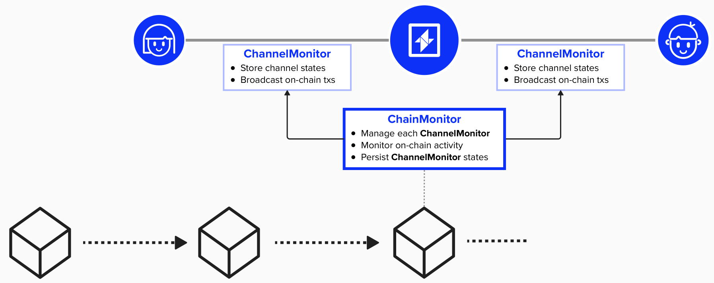
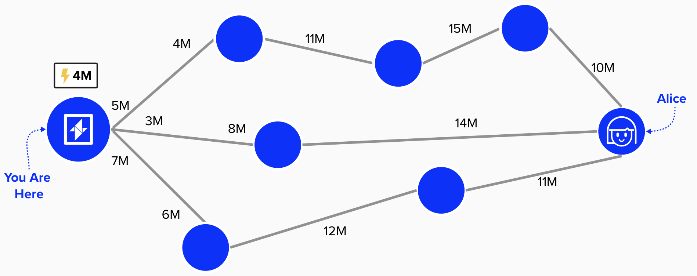

# Channel Management

Wow! While it may feel like we've implemented a lot so far (we have!), we've really only scratched the surface. As of now, our Lightning node can accomplish tasks such as:
- Fetch new blocks
- Broadcast transactions
- Estimate transaction fees
- Manage our node's keys
- Communicate with peers via Lightning's Gossip protocol

However, we're still missing two major pieces of the puzzle. We need to equip our node with the ability to leverage what we've built so far and coordinate the core operations of our Lightning node, including:
- Managing channel lifecycles (opening, closing, updating)
- Processing payments (sending, receiving, forwarding)
- Maintaining and advancing channel commitment transactions
- Responding to on-chain events that affect our channels

To implement this functionality, LDK provides a `ChainMonitor`, `ChannelMonitor`, and `ChannelManager`. The `ChainMonitor` and `ChannelMonitor` monitor on-chain activity, ensuring our node is able to react to any events that require our attention, such as a counterparty broadcasting an old commitment state. On the other hand, the `ChannelManager` focuses on off-chain activity, such as communicating with peers to advance channels state (ex: opening channels, sending payments, etc.). 


<p align="center" style="width: 50%; max-width: 300px;">
  
</p>

## ChainMonitor

LDK provides a `ChainMonitor` structure to connect ***off-chain*** **channel management** with ***on-chain*** **transaction monitoring**. To accomplish this, the `ChainMonitor` will track one or more `ChannelMonitor`s - one for each channel. The `ChannelMonitor` will instruct the `ChainMonitor` which outputs it should be monitoring for and, in return, the `ChainMonitor` will inform the `ChannelMonitor` if any events take place that require action. For example, if a counterparty publishes an old commitment transaction, our `ChainMonitor` will identify the output on-chain and inform the `ChannelMonitor`. The `ChannelMonitor` will proceed to publish the punishment transaction, claiming all of the channel's funds.

<p align="center" style="width: 50%; max-width: 300px;">
  
</p>


### Initializing The ChainMonitor and ChannelMonitor

To instantiate a new ChainMonitor, LDK provides a new method on the ChainMonitor structure. All you need to do is provide the following inputs:
- An optional chain source that implements the chain::Filter trait. For example, if your node is obtaining pre-filtered blocks or only fetching blocks if the compact filter matches, then it is important to notify the chain source which transactions are of interest. This option is particularly important for nodes that are seeking to minimize bandwidth usage and/or data processing, such as mobile clients.
  - If you put None as this input, it indicates that we are not pre-filtering blocks and, instead, fetching full blocks.
- A transaction broadcaster - responsible for broadcasting transactions to the Bitcoin network
- A logger - handles logging of events and errors
- A fee estimator - provides fee rate estimates for transactions
- A persister - handles persistent storage of channel state
);

```rust
let chain_monitor: ChainMonitor::new(
  None,
  broadcaster,
  logger,
  fee_estimator,
  persister,
);
```

### Initializing Gossip Sync
Now that we have a `NetworkGraph`, we're ready to start updating it with the latest gossip. Scandalous!

To do this LDK provides a `P2PGossipSync` component that, among other helpful utilities, receives and validates P2P gossip from peers. There other ways that we can initialize and keep up-to-date with gossip, such as **Rapid Gossip Sync**, but this will be covered later in the course.

```rust
let gossip_sync = P2PGossipSync::new(network_graph, logger)
```

## Routing

While each node has its own internal representation of the Lightning Network graph, the information within this graph is incomplete to optimally route payments. This is largely because, when nodes announce new (or updated) channels to the network, they do not specify how the capacity is distributed between the two channel parties, making it difficult to know for certain if a given channel is a viable option when routing payments. 

This presents two fundamental challenges when routing payments on the Lightning Network:

1) Missing Information: Nodes may not know if a given channel's liquidity is prohibitively unbalanced.
2) Path-Finding Optimization: If multiple payment paths exist, we must decide which path is the best.


<p align="center" style="width: 50%; max-width: 300px;">
  
</p>

#### Question: Of the above three paths (top, middle, bottom) from you to Alice, which path is optimal if you want to route 4M sats to Alice? You an assume each node has the same routing fees.

<details>
  <summary>Answer</summary>

If we assume that each path has the same routing fees, then the bottom path is the best. This is because it only has three nodes in the payment route, while the top path has four. Since we're assuming each node has the same fee stucture, then then this will be the cheapest. The middle path would not work because we only have 3M sats on our side of the channel, so we cannot route 4M sats through this path.

</details>

To help address both of the above challenges, LDK provides a `ProbabilisticScorer`. This component holds information about our node's current view of the Lightning Network graph, including estimates of available liquidity within each channel. It also records historical liquidity observations, which are updated each time our node either fails or succeeds at making a payment (or probe).

Ultimately, a `ProbabilisticScorer` is used to identify the optimal path for routing a payment by scoring each channel in a candidate path. With this information, the `ProbabilisticScorer` helps identify routes with a high probability of success while minimizing transaction fees.

### Initializing The `ProbabalisticScorer`

To create a new `ProbabalisticScorer`, you wil first need to define `ProbabilisticScoringDecayParameters`. These parameters configure how each channel’s available liquidity estimates are updated over time.

Given that the Lightning Network graph is constantly changing as payments flow throughout the ecosystem, our LDK node must account for the passage of time and assume that channel balances will change even if our node has not probed or otherwise interacted with a channel in a while. For example, our node's estimate for a given channel's available liquidity will become larger if time passes and we don't interact with it. This is because we are ***less*** certain of the true capacity. Larger ranges can then be penalized in the path-finding algorithm.

The `ProbabilisticScoringDecayParameters` can be customized, but default settings are also available. You can access the default parameters in the following manner:

```rust
let params = ProbabilisticScoringDecayParameters::default();
```

Once you define the decay parameters, LDK provides a `new` method that you can call on the `ProbabilisticScorer` to create a new instance of it.

```rust
let scorer = ProbabilisticScorer::new(params, network_graph, logger);
```

### Initializing The `Router`

The `ProbabilisticScorer` assists in finding the optimal path by providing our node with a perspective of the Lightning Network graph and the estimated available liquidity for each channel. However, it does not do the path-finding optimization itself.

To assist in finding the optimal payment route, LDK provides `ProbabilisticScoringFeeParameters`. These fee parameters impact how our node optimizes its routing decisions. Broadly speaking, `ProbabilisticScoringFeeParameters` contains various parameters that help select paths with desirable properties (ex: fewer hops, reliable, private, low fees, etc.).

Similar to the `ProbabilisticScoringDecayParameters`, these settings can be customized, but defaults are provided.

```rust
let scoring_fee_params = ProbabilisticScoringFeeParameters::default();
```

Once the scoring parameters are provided, you can set up a routing component using the `DefaultRouter`.

```rust
let router = DefaultRouter::new(
  network_graph,
  logger,
  entropy_source,
  scorer,
  scoring_fee_params,
));
```

Note, an entropy source is provided to the router to enhance the privacy of the payment. This is because, when payments are routed across the network, each node specifies its `cltv_expiry_delta`, which indicates the number of blocks that a node requires to forward a payment to the next hop in a payment route. However, an adversarial node could observe the `cltv_expiry` of the next hop and compare it to the known `cltv_expiry_delta` that are advertized in `channel_update` messages, thus infering their position in the payment route.