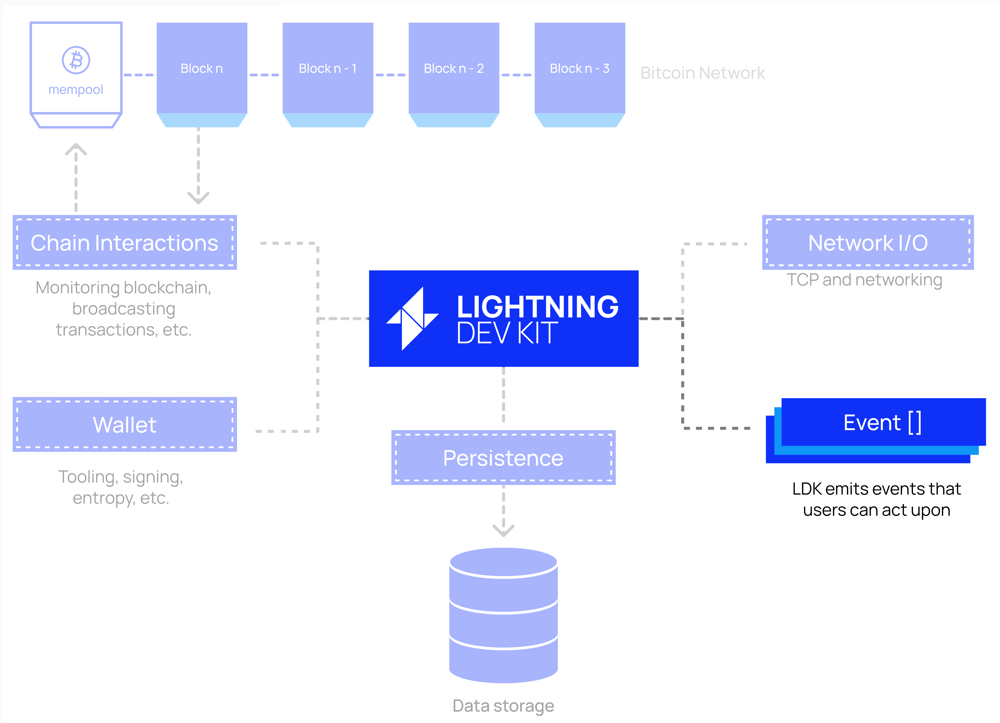

# Handling Events

Have you ever heard the saying "it takes two to tango"? Well, it takes (at least) two to Lightning! In other words, our node cannot enjoy the full benefits of Lightning without interacting with others on the Lightning network. To ensure our node can properly do that, we need to set up a way to handle all the types of events that can occur on the Lightning network.

Leveraging an event-driven architecture provides a few benefits to the developer:

- **Separation of Concerns**: Each LDK component (ex: `ChannelManager`, `ChainMonitor`, `PeerManager`) can focus on executing its responsibilities. If it needs to communicate with another component, such as a `ChainMonitor` informing a `ChannelManager` that an on-chain punishment transaction has been broadcasted and a channel should be closed, then the component can send an event to the intended recipient component and then continue with its core responsibilities.
- **Customized Architecture**: Event-driven architecture and separation of concerns allow for developers to further customize their lightning applications. For example, as we saw earlier, a developer can choose to deploy their `ChainMonitor` (or a replica of their `ChainMonitor`) on a different server than their main application. This provides additional assurance that, if their main application were to crash, they have a backup server that is focused on watching on-chain activity and responding appropriately. Therefore, when their application resumes operation, the `ChainMonitor`, hosted on another server, can simply send a notification event to the `ChannelManager` and inform them of any relevant activity.
- **Custom Business Logic**: By leveraging an event-driven architecture, LDK allows the user to add additional business logic before processing events. For example, when a new node is attempting to open a channel with you, your node will receive an `OpenChannelRequest`. You, the developer, can customize how you would like your node to react to this message. For example, perhaps there is some sort of reputation system that you have access to for public nodes, and you would like to check the reputation of the node before accepting. You can program this business logic within your application when handling this event.

<p align="center" style="width: 50%; max-width: 300px;">
  
</p>

## Setting Up An Event Handler

To set up an **Event Handler**, we'll need to define a function that can process the provided event. To do this, we can define a funciion (for example, `handle_ldk_events`) that will take in a wide variet of components that we'll need access to. We'll then create a long `match` statement, which will take a given `event` and execute the logic that we've implemented within this function.

Below is a non-exaustive list of events that LDK will make available to us, and our node would have to respond to these events. Many of these events will have parameters that come with them. For example, when our node receives an `OpenChannelRequest` event, our peer will also provide a `temporary_channel_id`, `counterparty_node_id`, `funding_satoshis`, and more.

```rust
pub enum Event {
  OpenChannelRequest {
    temporary_channel_id, // temporary channel id of channel requesting to be opened
    counterparty_node_id, // node id of counterparty requesting to open channel
    funding_satoshis, // channel value
    ..
  },
  ChannelPending {..},
  ChannelReady {..},
  PaymentSent {..},
  PaymentFailed {..},
  PaymentPathSuccessful {..},
  PaymentPathFailed {..},
  ProbeSuccessful {..},
  ProbeFailed {..},
  PendingHTLCsForwardable {..},
  HTLCIntercepted {..},
  PaymentForwarded {..},
  DiscardFunding {..},
}
```

You can read the full of events [here](https://docs.rs/lightning/latest/lightning/events/enum.Event.html).


### ⚡️ Implement handle_ldk_events

Let's go ahead and start implementing our event handler! To do this, we'll create an asyncronous `handle_ldk_events` function. As you can see, this will have access to many of the structures that we've reviewed as part of this workshop, such as:
- ChannelManager
- BitcoinClient
- KeysManager
- PeerManager
- FileStore

To complete this function, you'll need to complete the `OpenChannelRequest` portion of the match statement. The rest of the events can be left blank. Also, to further emphasize that this is a great place to add business logic, let's check the `channel_value_satoshis` and only accept a channel if it's for over 5,000,000 sats. We don't have time for small channels!

```rust
async fn handle_ldk_events(
  channel_manager: ChannelManager, bitcoind_client: BitcoindClient,
  network_graph: NetworkGraph, keys_manager: KeysManager,
  bump_tx_event_handler: BumpTxEventHandler, peer_manager: PeerManager,
  inbound_payments: InboundPaymentInfoStorage,
  outbound_payments: OutboundPaymentInfoStorage, fs_store: FilesystemStore,
  output_sweeper: OutputSweeperWrapper, network: Network, event: Event,
) {
  match event {
    Event::OpenChannelRequest {
        temporary_channel_id,
        counterparty_node_id,
        funding_satoshis,
        channel_negotiation_type,
        ..
      } => {
    },
    Event::FundingTxBroadcastSafe { .. } => {},
    
    Event::PaymentClaimable { .. } => {},
    
    Event::OpenChannelRequest { .. } => {},
    
    Event::PendingHTLCsForwardable { .. } => {},

    Event::SpendableOutputs { .. } => {},

    Event::ChannelReady { .. } => {},

    Event::ChannelClosed { .. } => {},

  }
}
```

## Starting The Event Handler

Once we've configured our custom logic for handling LDK events, we'll need to start a **background processor**. The background processor will orchestate all of the components that we've created, glueing them together so that they can process events and communicate with each other. The **event handler** that we defined previously will be provided to the background processor as an input.

When processing events, LDK will first handle events itself, then it will pass those events on to our custom event handler for further processing. For example, when payments (or probes) succeed or fail, LDK updates its internal scorer so that it can better estimate the capcaity of any given channel and optimize future routing. These events (`PaymentPathSuccessful`, `PaymentPathFailed`, `ProbeSuccessful`, `ProbeFailed`) will be processed first by LDK via the background processor, and then they will be passed on to our custom handler for, if applicable, further processing.

Now, let's review the two ways that we can set up a background processor for our application.

### `BackgroundProcessor`
LDK provides a `lightning-background-processor` crate that provides utilities which take care of tasks that:
1) Need to happen periodically to keep your node running.
2) Can or should happen in the background.