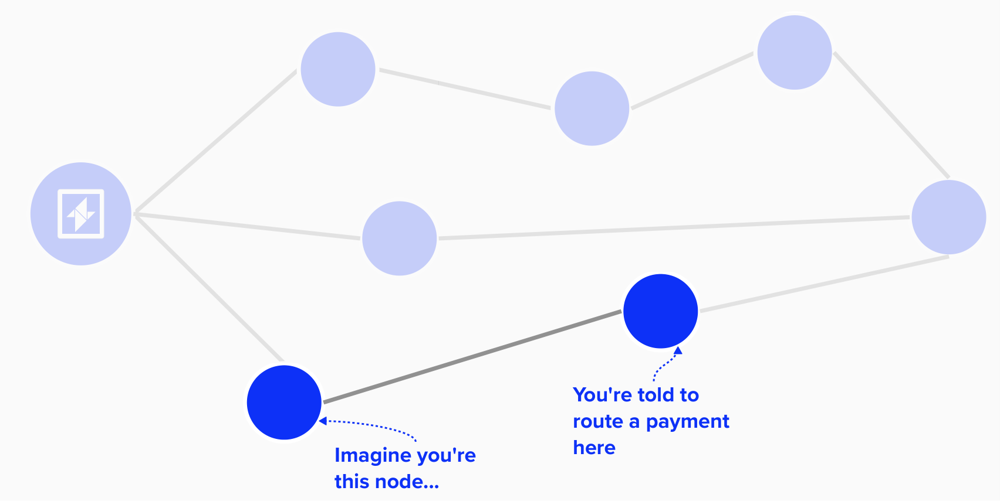

# Sending Payments

Wow, we've come a long way! By now, you're probably itching to send some payments. After all, the real joy of Lightning is "slinging sats", as they say.

## Payment Protocols

To send payment in Lightning, we're going to have to follow one of various protocols. Just as we saw with constructing our commitment transactions earlier, these protocols are designed to make sending payments within a decentralized context possible. 

#### Question: Why do we need a payment protocol to send payments? 
<details>
  <summary>Answer</summary>

Before discussing Lightning, it may be helpful to review the concept of "languages as permissionless protocols". For example, if you would like to learn English and communicate with others using the English langauge, then you can do that *without anyone elses permission*. Of course, there may be obstacles that one has to overcome to learn this language, but there is no authority that you will need to ask for permission. Furthermore, once you decide to learn English, you won't simply make things up as you go. Instead, you will have to learn predefined words, definitions, and gramatical structures that already exist.

Lightning is very similar. You don't need anyone's persmission to enter the Lightning network. You just need to follow the rules. Following this idea, we can see how we will need a protocol.

 // write about different apps trying to post across eachother //

</details>

Lightning has a few different payment protocols. Before reviewing them, it's helpful to first split them into two categories: **BOLT-Standardized** and **Non-Standardized**.

### BOLT-Standardized Payment Protocols
**BOLT-Standardized** payment protocols are those that have a Lightning Basis of Technology (BOLT), which describes how they work. By creating standardized and detailed documentation as to how these payment protocols work, it makes it much easier for Lightning implementations to follow the specs and ensure that their applications are compliant with the protocol.
- **BOLT 11: Invoices**: BOLT 11 is the original payment protocol and, therefore, the most widely used and adopted as of early 2025. This protocol describes how one can *request* payments over lightning. This protocol is the one we'll review in this section of the workshop.
- **BOLT 12: Offers**: BOLT 12 is a newer protocol that makes some improvements on BOLT 11. For example, it introduces the concept of "offers", where an entity (ex: merchant, non-profit, individual, etc.) can post and recieve an invoice in return.

### Non-Standardized Payment Protocols
**Non-Standardized** payment protocols are simply protocols that define a payment scheme but do not have a BOLT associated with them. They can be industry innovations that were created to service existing needs in the payment space.
- **Keysend Payments**: Before BOLT 12 was implemented and popularized, entreprenurs developed a new way to send payments that did not require the recipient the generate a new invoice for each payment they were recieving. Instead, the recipient would just provide their node ID, and the payer would create the preimage *themselves* and encrypt it within the payment union such that only the recipient could decrypt it and claim the payment. This provided a few benefits, such as the sender being able to arbitrarily send any amount of bitcoin to the recipient whenever they liked. However, it also has large trade-offs, such as the sender not recieving any sort of reciept or confirmation that they were the ones who originated the payment.
- **Async Payments**: A down-side to most payment protocols on the Lightning network is that the recipient must be online when recieving the payment so that they can perform some action, such as releasing a preimage. Therefore, if they are offline when receiving the payment, they won't be able to complete. To remedy this, entreprenurs have developed asynchronous payments, whereby an intermediary routing node, such as a Lightning Service Provider (LSP), holds the Lightning payment until the recipient is online.
  
## BOLT 11
BOLT 11, the original payment standard for Lightning, defines a payment protocol whereby the recipient of a payment will provide an invoice with all of the required information needed to send a payment over the Lightning network.

For instance, let's return to our example from earlier in the workshop. Here, we'd like to tip Alice for being a great person, but we don't have a direct channel open with Alice ☹️. Luckily, we can route payments through the Lightning Network and pay Alice that way! To start this process, we ask Alice to send us an invoice. Since we're tipping her, Alice won't specify the amount we need to tip her - she's greatful for any amount.

Alice will generate the invoice and send it to us.

<p align="center" style="width: 50%; max-width: 300px;">
  
</p>

### BOLT 11 Invoice

When we recieve the invoice from Alice, it will have the following structure:
- **Human Readable Part**: The human readable part contains information that is, generally, easily to understand just by looking at it. It has the following fields:
  - **prefix**: This tells us which Bitcoin network the invoice is for. For instance, `lnbc` is for mainnet while `lnbcrt` is for regtest`.
  - **amount**: This field is optional, and it tells us the number of bitcoin that the invoice is for. There is also a multiplier provided, which is meant to be multiplied by the `amount`. The result is the actual amount that the invoice is for.
- **Data Part**: The data part is not human-readable, but it does contain vital information for the payment.
  - **timestamp**: This is the time that the invoice is generated. Note, it is NOT the expiry time.
  - **tagged data fields**: This portion of the invoice contains various data fields, such as the preimage hash, payee public key, description of payment, and exipry time (sepecified in seconds and added to `timestamp`). 
  - **signature**: Finally, a signature is provided, which allows the payee to attest to the information being sent in the invoice.

<p align="center" style="width: 50%; max-width: 300px;">
  
</p>

Below is an example of what a Lightning invoice may look like. Notice the following:
1) The `1` that is not highlighted in the raw version of the invoice (on the left) is called a **separator**. To the left of it is the human readable part, and to the right is the data part.
2) There is no amount specified for this invoice.
3) There is a **checksum** at the end of this invoice, which verifies the integrity of the message.

<p align="center" style="width: 50%; max-width: 300px;">
  
</p>

#### Question: Why can't you re-use the same invoice for multiple payments?

<details>
  <summary>Answer</summary>

</details>


### Setting Up Our Payment

Equiped with this information, we'll be able to set up a series of HTLCs as we route our payment to Alice. Finding the ideal route will be an important steps before sending the payment. For this example, we'll assume that we're able to identify an ideal route, but later portions of this workshop will dive into this in more detail.

Once we identify the right route, we can construct the necessary instructions to route to each node along the route, informing them of how to set up an HTLC with their channel partner so that we can route our payment to Alice. Once Alice recieves the final HTLC with the preimage hash that she provided us, she'll recognize it and provide the preimage, thus starting the flow of unwinding the HTLCs all the way back to us.

<p align="center" style="width: 50%; max-width: 300px;">
  
</p>

Recall that each pair of channel partners within this route will set add an HTLC to their commitment transactions using the below structure. In this example, Node A is sending Node B 400,000 sats. If you zoom in, you can also see some fields are highlighted - namely `cltv_expiry` and `payment_hash`. This is because, these are special fields for the following reasons:
- `payment_hash` is provided by the payee (Alice, in this case) when she is sending an invoice.
- `cltv_expiry` is the expiry block for the HTLC. Alice has the option to provide this value in the invoice as well. If she does, then we need to make sure that the `cltv_expiry` for the last hop is at least this value. If she does not provide a value, the default is 18 blocks.

<p align="center" style="width: 50%; max-width: 300px;">
  
</p>

#### Question: Imagine you're the node that is marked in the image below. You're routing a payment to another node. How would you know what the right timeout (`cltv_expiry`) is for this node?

<p align="center" style="width: 50%; max-width: 300px;">
  
</p>

<details>
  <summary>Answer</summary>
This can actually be quite confusing, so it's important to spend a moment discussing how this works.

First, as we've already learned, the `cltv_expiry` is the block height that the HTLC expires, leaving it open to be claimed by the **HTLC Offerer**. If we're forwarding a payment, we shouldn't know which hop we are in the route, so we can't really select this expiry time ourselves.

Therefore, when the sender is putting together the route, which is sent to each node in an onion message, they will calculate the `cltv_expiry` that each channel should use in their HTLC constructions.

</details>

### Informing Peers How To Set Up Channels 

As mentioned above, when sending payments, we (the originator of the payment) will need to wrap payment information, called a **payload**, up for each hop in the route. These payloads will provide vital pieces of information, such as the `cltv_expiry` that each HTLC along the route must have. Payload are communicated within the `upate_add_htlc` message, which is a message that peers will send to each other when deciding the advance their channel state by adding a new HTLC output.

The payloads are a special field within the `upate_add_htlc` message. This is because this onion originates from  be wrapped such that each layer is encrypted. At each hop, the recipient of the payload will only be able to read the outer layer, which only they can decrypt. This is because each layer is encrypted using a shared secret that is created using the public node id that the given recipient broadcasts to the larger network as part of the gossip protocol. Since (hopefully!) only the recipient knows the private key to their public key, they will be the only ones who will be able to compute the shared secret the decrypts the payment instructions. 

<p align="center" style="width: 50%; max-width: 300px;">
  
</p>

#### Question: You're familiar with the `payment_hash` (preimage hash), but Alice will also send a `payment_secret`, which is a random 32-byte secret provided with the invoice. This is included in the invoice that Alice sends us, and we send it back in the payload that we construct when routing the payment to Alice. Why do you think we do this? What attacks does would the inclusion of this field help prevent?

<p align="center" style="width: 50%; max-width: 300px;">
  
</p>

<details>
  <summary>Answer</summary>

</details>


### Sending A Payment In LDK

To initiate a payment with LDK, we can use the `send_payment` function within the `ChannelManager`. This function will take the following parameters as inputs:

- `payment_hash`: This is the hash of the payment preimage. This needs to be included in each HTLC that is set up along the payment path. If the payment is successful, the recipient will reveal the preimage that, when hashed, equals the `payment_hash`.
- `recipient_onion`: This is the encrypted payloads for each hop in the route.
- `payment_id`: This is a *user-provided* identifier for payments in LDK. While it is not a protocol identifier, LDK will use it to ensure it does not send payments with the same `payment_id`, and it can be helpful if the developer would like to implement their own tracking methodology for payments.
- `route_params`: These are configurations we can pass to LDK's routing algorithm, such as the maximum amount of fees we'd like to pay and any failed channels that we've tried in the past for this payment.
- `retry_strategy`: Finally, we can pass a retry strategy, which informs LDK of what we'd like to do if our payment fails. For example, we can specify that we'd like to retry the payment for a maximum of 3 attempts.

This function will return either of the following two:
- `Ok()`: The payment has succeeded.
- `RetryableSendFailure`: The payment failed for one of the following reasons: `PaymentExpired`, `RouteNotFound`, `DuplicatePayment`, `OnionPacketSizeExceeded`.

```rust
pub fn send_payment(
    payment_hash: PaymentHash,
    recipient_onion: RecipientOnionFields,
    payment_id: PaymentId,
    route_params: RouteParameters,
    retry_strategy: Retry,
) -> Result<(), RetryableSendFailure>
```